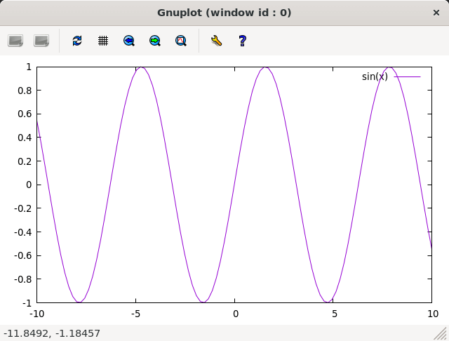

# もくもくインストール

mokumoku-installation

## 目的

Windows PCに

- WSLを導入し、その上に
- Ubuntuをインストールして、科学技術計算向けの設定を施し、
- 電子状態計算ソフトウェアPHASE/0をインストール

します。

Windows PCは以下の要件を満たすことを前提とします。

- Intel系プロセッサを搭載したWindows10もしくは11の64bit版(HomeもしくはPro)
- CPUが、仮想化支援機能に対応していること（Intel VT／AMD-V）

一部の操作では管理者権限が必要です。特に、会社所有のPCをご使用の場合はご注意ください。

Macなど、Windows以外の計算機については、[付録A](#付録awindowswsl-ubuntu以外の計算機)にて簡潔に説明します。

## 選択肢

環境設定に際し、選択の自由度があります。どれを選ぶのか決めてから、作業に着手してください。

### WSLのバージョン

- WSL1
- WSL2

WSLには、WSL1とWSL2があります。バージョン2は、バージョン1の完全上位版ではありません。また、インストール後に相互変換可能です。

[WSL 1 と WSL 2 の比較 \| Microsoft Docs](https://docs.microsoft.com/ja-jp/windows/wsl/compare-versions)

<!-- なお、WSL2に対応した実行基盤上でWSL1を動作させることが可能ですので、実行基盤はWSL2対応のみを説明します。 -->
<!--WSL2はHyper-Vと共存できません。-->

### Xサーバーソフトウェア

- [MobaXterm](https://mobaxterm.mobatek.net)
- [VcXsrv](https://sourceforge.net/projects/vcxsrv/)

一般的にLinux環境では、グラフィックス描画にX Window Systemという仕組みを利用します。その仕組みを利用する（表示を担う）ためのソフトウェアが「Xサーバー」です。[VcXsrv](https://sourceforge.net/projects/vcxsrv/)は、代表的なWindows用のXサーバーソフトウェアです。インストールには管理者権限が必要です。
一方[MobaXterm](https://mobaxterm.mobatek.net)は、Xサーバー付き（他にも盛沢山）の端末ソフトウェアです。WSLで材料シミュレーションを実行する目的にはオーバースペックですが、第一原理計算を本格活用すると手元のパソコンだけでは不十分で、他の（大規模な）計算機を利用するようになります。他の計算機にアクセスする際には、MobaXtermのような端末ソフトウェアが必要になりますので、決して無駄ではありません。MobaXtermには、「インストーラー版」と「ポータブル版」があります。

迷った方には、MobaXtermの「ポータブル版」をお勧めします。

## 環境設定

### Windows用追加ソフトウェアのインストール

WSLの設定に先立ち、Windowsアプリケーションをインストールします。

#### Windowsインストーラー利用

Windowsの作法に則ってインストールします。Windowsの管理者権限が必要です。

- [VcXsrv](https://sourceforge.net/projects/vcxsrv/)


- [MobaXterm](https://mobaxterm.mobatek.net)


#### ポータブル版

（管理者権限不要です）

ZIPファイルをダウンロードし、展開したものをお好きなディレクトリに配置してください。exeファイルをダブルクリックして実行します。

- [MobaXterm](https://mobaxterm.mobatek.net)


- [VESTA](http://jp-minerals.org/vesta/jp/)

原子配置や電荷密度分布の可視化に利用するソフトウェアです。

64bit版の利用をお勧めします。


ダウンロードしたZIPファイルを展開します。


### WSL実行基盤の設定とUbuntuのインストール

WSLのインストール手順はシンプルです。

スタートメニューの右クリックから、管理者権限のWidowns PowerShell（もしくはコマンドプロンプト）を起動し、以下コマンドを実行するだけで、Ubuntu（ディストリビューションの既定値；2022年12月時点では`22.04 LTS`）がインストールされます。

```sh
wsl --install
```

[WSL を使用して Windows に Linux をインストールする](https://docs.microsoft.com/ja-jp/windows/wsl/install)

再起動を促された場合は、指示に従って再起動してください。
サインインすると[初回起動](#初回起動)が始まります。

このコマンドは、

- WSL実行基盤が整っていない場合は、それを整えてから
- ディストリビューションをインストール

します。
前者「実行環境を整える」には管理者権限が必要ですが、後者のディストリビューションのインストールに管理者権限は不要です。
前者のみを実行するコマンドは無いようですので、インストールされるディストリビューションが不要な場合はインストール後に削除するか、[手動で実行環境を整えて](https://github.com/matelier/moku-moku/blob/f373f46d1a4a65810831cd8394f5451433429040/installation/README.md)ください。
また、`WSL`がすでにインストールされている場合、上記コマンドはヘルプメッセージを表示して終了します。
次節以降を参照して、[ディストリビューションを指定したオンラインインストール](#規定値以外のディストリビューションのオンラインインストール
)、もしくは、[Microsoft Storeからインストール](#microsoft-storeからのディストリビューション導入)してください。

普段、管理者権限を持たない一般ユーザーとしてサインインしている方は、管理者としてサインインしてコマンド実行することをお勧めします。
一般ユーザーとしてサインインして、管管理権限のWidowns PowerShell（もしくはコマンドプロンプト）から上記コマンドを入力した場合は、`Ubuntu`は管理者アカウントにインストールされますのでご注意ください。

なお、管理者がディストリビューションをインストールすると、WSL2になるようです。
管理者として実行基盤を整え、一般ユーザーがディストリビューションをインストールした場合は、WSL1が既定値です。
一般ユーザーも既定値をWSL2にするためには、以下コマンドを実行します。

```sh
wsl --set-default-version 2
```

導入後のWSL1 <-> WSL2の相互変換は、[付録C](#付録cwsl1とwsl2の相互変換)を参照してください。

#### 既定値以外のディストリビューションのオンラインインストール

`wsl --install`コマンドでインストール（オンラインインストール）できるのは`Ubuntu`だけではありません。
以下のコマンドで、オンラインインストール可能なディストリビューション一覧が表示されます。

```powershell
PS C:\Users\matelier> wsl -l --online
The following is a list of valid distributions that can be installed.
Install using 'wsl --install -d <Distro>'.

NAME                                   FRIENDLY NAME
Ubuntu                                 Ubuntu
Debian                                 Debian GNU/Linux
kali-linux                             Kali Linux Rolling
Ubuntu-18.04                           Ubuntu 18.04 LTS
Ubuntu-20.04                           Ubuntu 20.04 LTS
Ubuntu-22.04                           Ubuntu 22.04 LTS
OracleLinux_7_9                        Oracle Linux 7.9
OracleLinux_8_7                        Oracle Linux 8.7
OracleLinux_9_1                        Oracle Linux 9.1
SUSE-Linux-Enterprise-Server-15-SP4    SUSE Linux Enterprise Server 15 SP4
openSUSE-Leap-15.4                     openSUSE Leap 15.4
openSUSE-Tumbleweed                    openSUSE Tumbleweed
PS C:\Users\matelier>
```

例えば`Ubuntu 20.04LTS`をオンラインインストールするためには下記コマンドを実行します。

```sh
wsl --install -d Ubuntu-20.04
```

#### Microsoft Storeからのディストリビューション導入

オンラインインストールできないけれども、Microsoft Storeから提供されているディストリビューションもあります。

例えば、Microsoft Storeにて、`wsl`で検索してください。
ディストリビューションを選び、表示される画面で`入手`もしくは`インストール`をクリックするとインストールされます。


インストール後、`開く`をクリックすると[初回起動](#初回起動)が始まります。

#### 初回起動

インストールに成功すると、Linuxの世界が始まります。
初回起動時に、ユーザー名とパスワードを設定します。
ユーザー名は、Windowsのユーザー名とは関係なく設定できます。
同じでも良いですが、全角文字の使用はお勧めしません。
パスワードにも全角文字を使用しないでください。

```sh
Enter new UNIX username:
New password:
Retype new password:
```

次回以降起動の際は、スタートメニューに`Ubuntu`などの項目が現れるので、それを選択してください（メニュー項目の詳細はインストールしたディストリビューションに依存します）。

### Linux開発環境設定

以下の三つのコマンドを実行して、必要なソフトウェア（ライブラリ）を導入します。
コマンド実行時にパスワード入力を求められたら、初回起動時に設定したパスワードを入力します。

```sh
sudo apt update
sudo apt upgrade -y
sudo apt install -y make gnuplot-x11 gfortran libopenmpi-dev libfftw3-dev liblapack-dev libopenblas-dev evince
```

各コマンドの実行には時間を要します。
ネットワーク環境が良いところで実行してください。
ただし、セキュリティに厳しい組織内で実行すると、ファイヤーウォールで通信が遮断される場合があるそうです。

Linux上での作業には、テキストエディタを使用します。
標準で`vim`や`nano`はインストールされています。
`Emacs`や`gedit`を使いたい人は、追加インストールしてください。

```sh
sudo apt install -y emacs
```

```sh
sudo apt install -y gedit
```

### X Windows Systemの設定

WSL環境からグラフィックスをWindowsの画面に表示するための設定です。

Xサーバー（VcXsrvもしくはMobaXterm；これらはWindowsのアプリケーションです）を起動してください。

<details>
<summary>VcXsrv</summary>

スタートメニューから、`VcXsrv` - `XLaunch`を選択します。幾つか設定項目があります。最初の二つは「次へ」を押してください。


`Disable access control`にチェックを入れてください。


以上を毎回設定するのは面倒なので、`Save configuration`を押してください。


例えば設定ファイルをデスクトップに配置すると、以下のアイコンが表示されます。これをダブルクリックすると、保存した設定のXサーバーが起動します。


</details>

<details>
<summary>MobaXterm</summary>

インストール版はスタートメニューから、ポータブル版はZIP展開したファイルを選択して起動します。


</details>

今回はXサーバー（VcXsrvもしくはMobaXterm）とXクライアント（WSLで動作するUbuntu）を単一のWindows PCで動作させますが、WSLは仮想計算機として、Windowsとは別の計算機であるかのように振る舞います。また、大規模な計算機を利用する場合も、その計算機（Xクライアント；PCクラスター、スパコンなど）で描画コマンドを発行し、ネットワークを介して、手元のPC（WindowsのXサーバー）で表示させる使い方が一般的です。その際、Xクライアントに、Xサーバーの画面が（ネットワーク上の）どこにあるのか指示するために、`DISPLAY`環境変数を設定します。

- WSL1の場合

```sh
export DISPLAY=localhost:0
```

- WSL2の場合

```sh
export DISPLAY=`hostname`.mshome.net:0
```

（参考）Qiita: [WSL2 での DISPLAY 設定](https://qiita.com/taichi-ishitani/items/b627e31a97fef24c6ee4)

Xサーバーの動作を確認します。

```sh
gnuplot
```

```gnuplot
gnuplot> set term x11
gnuplot> plot sin(x)
```

sin関数が表示されれば、Xサーバーが正常に動作しています。



### ファイル共有

WSLは、Windowsから独立した計算機であるかのように動作しますが、ファイルを共有するための仕組みが用意されています。

#### WSLから、Windowsのファイルを読み書きする

WindowsのCドライブは、WSLの`/mnt/c`にマウントされます。
例えばWindowsのデスクトップに配置されたファイルは、Cドライブ以下`Users\[ユーザー名]\Desktop\`にあります。

WSLのホームディレクトリにWindowsデスクトップへのリンクを作成すると、デスクトップを介してのファイル共有に便利です。

```sh
cd
ln -s /mnt/c/Users/[ユーザー名]/Desktop
ls Desktop
```

`[ユーザー名]`は、Windowsのユーザー名です。

#### Windowsから、WSLのファイルを読み書きする

WSLのファイルシステムは、Windowsからはネットワークドライブの様に見えます。
エクスプローラーを起動してアドレスバーに`\\WSL$`と入力すると、`Ubuntu`などが表示されます。これがWSLのファイルシステムです。
うかつに操作するとWSL環境を破壊しかねませんので、ご注意ください。

## アプリケーションのコンパイル

### PHASE/0

PHASE/0のソースコードを[ダウンロード](https://azuma.nims.go.jp/cms1/downloads/software/)（登録が必要です）し、`phase0_2022.01.tar.gz`をWindowsのデスクトップに配置します。
Ubuntuを起動し、ホームディレクトリにこれらのファイルをコピーします。

```sh
cp /mnt/c/Users/[ユーザー名]/Desktop/phase0_2022.01.tar.gz ~
```

ファイルを伸長します。

```sh
cd
tar zxf phase0_2022.01.tar.gz
cd phase0_2022.01
```

`Ubuntu 22.04LTS`を使っている場合は、付属する`Makefile.Linux_generic`でコンパイルできません。
[こちら](https://github.com/Materials-Science-Software-Consortium/phase0_install/tree/2022.01/Ubuntu22LTS)の指示に従ってインストールしてください。

```sh
cd src_phase
make -f Makefile.Linux_generic install
```

## 動作検証

続けて、付属サンプル`samples/basic/Si8`で動作を検証します。

```sh
cd samples/basic/Si8
```

### PHASE/0：電子状態計算

まず、1コアだけ利用して計算します（非並列）。

```sh
../../../bin/phase
```

ファイル`jobstatus000`（二回目以降の実行では001, 002, ...）に経過時間が出力されます。

```C
 status       =      FINISHED
 iteration    =             15
 iter_ionic   =              1
 iter_elec    =             15
 elapsed_time =       201.3720
```

5行目が経過時間（単位：秒）です。

### PHASE/0：並列計算

次に並列計算をテストします。`-np 2`で2並列で実行することを指示します。WSL1では並列実行時にWarningが出力されますが、計算結果に悪影響はありません。

```sh
mpiexec -np 2 ../../../bin/phase
```

実行時間が概ね半分になっていれば（半分より少し多くて）正常です。物理コア数以上の並列は実行時間の短縮になりません。

### 電荷密度分布の可視化（VESTA）

上記実行サンプルでは電荷密度分布が出力されていますので、それを描画します。VESTAを起動して、上部メニューから`Files` - `Open...`を選択し、ファイル選択ダイアログからアドレス（フォルダ位置）を以下のように設定します。最初に`\\wsl$`を入力して、マウス操作で選択すると便利です。

```cmd
\\wsl$\Ubuntu\home\[ユーザー名]\phase0_2021.02\samples\basic\Si8
```

選択可能なファイルとして`nfchr.cube`ファイルが表示されますので、これを選択するとVESTAで描画されます。


この意味にご興味ある方は、PHASE利用講習会や[材料シミュレーションもくもく会](https://m3aterial.connpass.com/)に参加してください。

## 付録A：Windows（WSL Ubuntu）以外の計算機

コンパイラ（C, Fortran）、MPI（並列計算ライブラリ）、FFTW3（高速フーリエ変換ライブラリ）を用意すると何とかなる場合が多いです。
その他 Python3, gnuplot, Emacsなどお好みで追加してください。

### WSLのUbuntu以外のディストリビューション

- オンラインインストール
  - 「wsl -l --online」コマンドで一覧表示されます。
- Microsoft Store
  - Microsoft Storeを起動し、`wsl`で検索してください。
- その他
  - [Project List Using wsldl \| Wsldl official documentation](https://wsldl-pg.github.io/docs/Using-wsldl/#distros)

### Mac

[Mac (Apple Silicon) へのインストール手順](https://github.com/Materials-Science-Software-Consortium/phase0_install/blob/main/Mac_M1/README.md)を参照してください。

[XQuartz](https://www.xquartz.org)は、Macで動作する代表的なXサーバーです。インストールしてください。

Macのターミナルは、UNIX的に利用できます。仮想計算機ではありませんので、`DISPLAY`環境変数を意識する必要はありません。

### Linux：Ubuntu

使わなくなったWindows PCがあれば、Linuxを実機にインストールして利用できます。
[Ubuntu](https://jp.ubuntu.com)はデスクトップ環境での利用を指向したディストリビューションですが、長期サポート（long-term support; LTS）が提供されていることが魅力です。

`apt`コマンドの引数など、WSLと同じように利用できます。Xサーバーは自動的にインストールされ、Xサーバーとクライアントが正真正銘の同一計算機で動作しますので`DISPLAY`環境変数の設定は不要です。

### Linux：Rocky Linux, AlmaLinux

PCクラスターなど常時稼働している科学技術計算用の実機には、Red Hat Enterprise Linux（以下RHELと記す）もしくはその互換OSが利用されることが多いです。
具体的にはCentOSがその筆頭でしたが、 CentOS 8は2021年末にEOLを迎えました（CentOS 7のEOLは2024年6月です）。
[Rocky Linux](https://rockylinux.org/)と[AlmaLinux](https://almalinux.org)は2022年以降も引き続き利用可能なRHEL互換OSの有力候補です。

RHEL互換OSでは、`dnf`コマンドでソフトウェア（ライブラリ）を導入します。

```sh
sudo dnf install -y gcc-gfortran openmpi-devel fftw-static perl gnuplot make patch
```

OpenMPI関連のコマンドは`/usr/lib64/openmpi/bin`以下にインストールされます。
環境変数`PATH`を設定してください。

```sh
export PATH=/usr/lib64/openmpi/bin:$PATH
```

Xサーバーは自動的にインストールされ、Xサーバーとクライアントが正真正銘の同一計算機で動作しますので`DISPLAY`環境変数の設定は不要です。

## 付録B：Windowsのアカウント制御

（まとめ）WSLが利用可能になってさえいれば、その他の項目は管理者権限不要の代替手段があります。

### 管理者権限が必要な作業

- WSLが利用可能になるようにWindowsの設定を変更
- VcXsrvのインストール
- MobaXtermのインストール（インストーラー版；`Program Files`以下にインストールする場合）

### 管理者権限不要

- MobaXtermのインストール（ポータブル版）
- VESTAのインストール
- （WSLが利用可能であることを前提として）Ubuntuをインストールし、それに各種設定を施す。

## 付録C：WSL1とWSL2の相互変換

次のコマンドで、ディストリビューション名とそのバージョンを調べます。

```powershell
> wsl -l -v
```

実行結果は以下のようになります。

```powershell
  NAME            STATE           VERSION
* Ubuntu-20.04    Stopped         2
```

ディストリビューション`Ubuntu-20.04`をWSL1に変換するには、以下のコマンドを実行します。

```powershell
> wsl --set-version Ubuntu-20.04 1
```

ディストリビューション`Ubuntu-20.04`をWSL2に変換するには、以下のコマンドを実行します。

```powershell
> wsl --set-version Ubuntu-20.04 2
```
