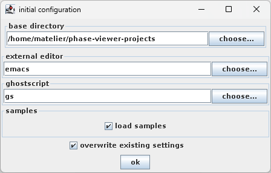
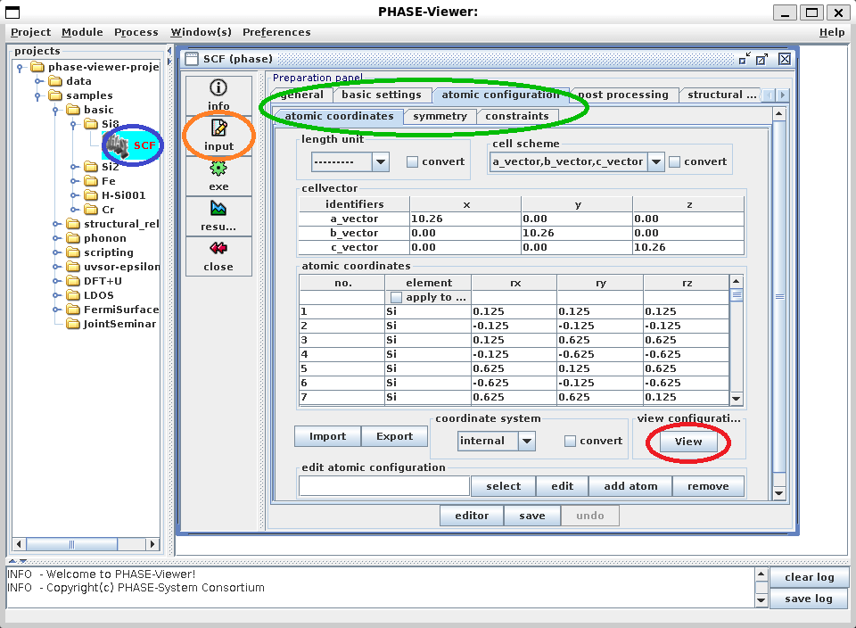
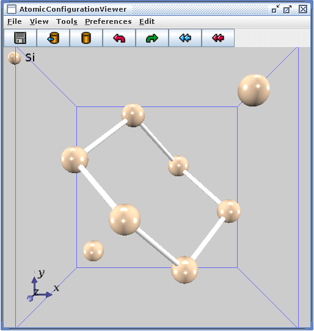
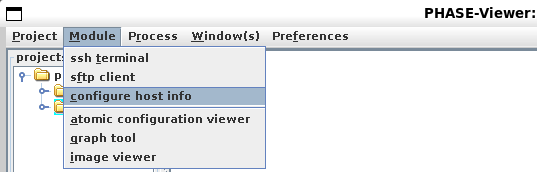
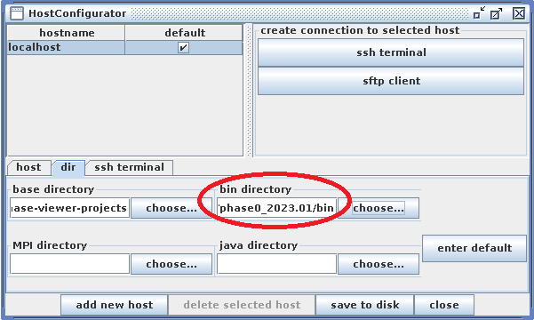
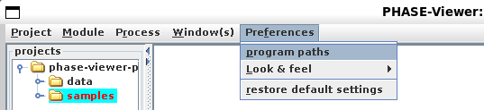
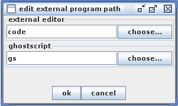

# PHASE-Viewer

PHASE-Viewerは、PHASE/0利用を支援するGUIです。
ここでは、WSLのUbuntu 22.04LTS環境におけるPHASE-Viewer利用を説明します。

[コマンド操作でPHASE/0を利用できる状態](https://github.com/matelier/moku-moku/blob/master/installation/README.md)を前提とします。

## インストール

PHASE-Viewerの動作には、Java実行環境(JRE)が必要です。
以下コマンドで追加インストールします。

```sh
sudo apt install default-jre
```

```sh
$ java --version
openjdk 11.0.21 2023-10-17
OpenJDK Runtime Environment (build 11.0.21+9-post-Ubuntu-0ubuntu122.04)
OpenJDK 64-Bit Server VM (build 11.0.21+9-post-Ubuntu-0ubuntu122.04, mixed mode, sharing)
```

PHASE/0付属のスクリプト群は、状態密度図やバンド構造図をEPS形式で生成します。
そしてPHASE-Viewerは、EPSをビットマップ画像に変換して表示します。
その変換にGhostscriptの助けを借りるので、これも追加インストールします。

```sh
sudo apt install ghostscript
```

PHASE-Viewerの本体は、ダウンロードして入手します。
執筆時点での最新版は、`PHASE-System 2020`の`phase-viewer_2020.zip`です。
ホームディレクトリ直下にて、ZIPファイルを伸長します。

```sh
unzip phase-viewer_2020.zip
```

以上で準備が整いました。
下記コマンドを実行して、PHASE-Viewerを起動します。

```sh
java -jar ~/phase-viewer/bin/phase-viewer.jar
```

### 初回起動

初回起動時のみ、下記ウィンドウが表示されます。



こだわりがなければ、そのまま`ok`を押してください。

- `base directory`: PHASE-Viewerが管理するデータを配置する大元のディレクトリです。既定値はホームディレクトリ直下の`phase-viewer-projects`です。
- `external editor`: テキストエディタを登録します。（後述）
- `ghostscript`: Ghostscriptコマンドを登録します。変更しないでください。

原子配置ビューアが動作することは、実用上とても重要です。
真っ先に確認しましょう。
ウィンドウ左側のディレクトリブラウザから、`samples` - `basic` - `Si8` - `SCF`を選びます（青丸をダブルクリック）。
`input`パネル（橙丸）から、`atomic configuration` - `atomic coordinates`タブ（緑丸）を選択し、`View`ボタン（赤丸）を押すと、原子配置ビューアが起動します。





マウス操作で回転、拡大・縮小などできることをお試しください。

原子配置ビューアが正常に動作しない場合は、[MobaXterm](https://mobaxterm.mobatek.net/)からWSLを起動して、MobaXtermのXサーバー利用をお試しください。
改善することがあります。

ここまでできたら、一旦、PHASE-Viewerを終了します。

## 各種設定

PHASE-Viewerを正常に利用するためには、追加設定が必要です。

- PATH
- Host情報
- ジョブコントロールスクリプト

の三つは必須です。
余裕があれば、テキストエディタも設定してください。

### PATH

ここまで[説明通りに実行する](https://github.com/matelier/moku-moku/blob/master/installation/README.md)と、`mpiexec`コマンドにはパスが通っています。
（実行時にコマンド名を与えると、実行ファイルの実体を探す設定ができている、という意味です。）

他方、コンパイル済みPHASE/0ソルバー`phase`, `ekcal`コマンドや、各種スクリプトにはパスが通っていませんので、ターミナルから下記コマンドを実行してパスを通します。

```sh
export PATH=~/phase0_2023.01/bin:$PATH
```

ログインの（新しいターミナルを起動する）度に実行する必要があります。
毎回実行するのが面倒な方は、`.bashrc`ファイルに書き込んでください。

### Host情報

PHASE-Viewerの上部メニューから、`Module` - `configure host info`を選びます。



表示されるウィンドウで、`dir`タブを選択して、`bin directory`（赤丸）をPHASE/0コンパイル済みバイナリがあるディレクトリ（`~/phase0_2023.01/bin`）に設定してください。



### ジョブコントロールスクリプト修正

`~/.phase-viewer/scripts/jobcontrol`にインストールされるスクリプトファイルの一部は、このままでは利用できません。
[ekcal/submit.sh](./pvscripts/ekcal/submit.sh)と[uvsor-epsilon/submit.sh](./pvscripts/epsmain/submit.sh)を、それぞれリンク先のファイルに置き換えてください。

### テキストエディタ

初回起動時に設定することができるテキストエディタは、後から変更可能です。
PHASE-Viewerの上部メニューから、`Preferences` - `program paths`を選びます。



表示されるウィンドウで、`external editor`にテキストエディタ起動コマンドを入力してください。



新規ウィンドウを開くテキストエディタであれば指定できます。

- Emacs（要GUIサポート; emacs-noxは不可）
- vim（要GUIサポート）
- gedit

などがあります。

ここではあえて、[Visual Studio Code](https://code.visualstudio.com/)（以下VSCodeと記す）の使用をご紹介します。
WSL (Ubuntu)環境にインストールすることもできますが、WindowsにインストールされたVSCodeを、WSL（PHASE-Viewerを含みます）から、シームレスに呼び出すことができます。

Windowsアプリケーションの作法に則ってインストールします。
WSL (Ubuntu)のターミナルから、

```sh
code
```

コマンドで、VSCodeが起動します。
PHASE-Viewerの`external editor`にも、`code`を指定します。

## PHASE-Viewerの使い方

GUIの操作方法は、別途説明を計画中です。

## 付録

### 環境をリセットする

### バージョンアップに際して
