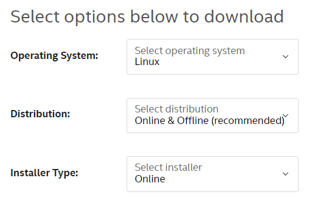

# WSLで動くRocky LinuxにoneAPIをインストール

## 概要

WSL上で動作するLinuxディストリビューションは、オンラインインストールやMicrosoftストアから入手できるものだけではありません。
ここでは[Rocky Linux](https://rockylinux.org/ja)をインストールする手順を説明します。

さらに、高性能開発環境としてoneAPIをインストールし、それを利用して材料シミュレーション用のアプリケーションソフトウェア[OpenMX](http://www.openmx-square.org/)をコンパイルするまで、を説明します。

WSL環境は構築済みとして説明します。
未完了の方は例えば[こちら](./README.md)を参照してください。

## Rocky Linux

RedHat Enterprise Linux (RHEL)互換ディストリビューションとして、長らく[CentOS](https://www.centos.org/)が君臨してきましたが、最新のStreamは、もはや我々が期待する互換ディストリビューション（ダウンストリーム）ではありません。
新たに複数のRHEL互換ディストリビューションが立ち上げられた中、**Rocky Linux**は、[AlmaLinux](https://almalinux.org/ja/)と共にその中心的な役割を担うことが期待されています。

WSL用のRocky Linuxは[こちら](https://github.com/mishamosher/RL-WSL)で配布されています。
`RL9.zip`をダウンロードしてください。
ファイルを展開し、フォルダ内の`Rocky9.exe`を実行すると、その場にRocky Linuxがインストール（ファイルが展開）されます。
Ubuntuなどの（標準的な）ディストリビューションは`c:\Users\ユーザー名\AppData\Local\Packages\`以下にインストールされますので、それを真似て、RL9フォルダを`c:\Users\ユーザー名\AppData\Local\Packages\RL9`に移動します。
そのフォルダ内の`Rocky9.exe`を実行すれば、インストール完了です。
`Rocky9.exe`の名前を変えると複数のRocky Linux環境を保持できます。

ちなみにアンインストールの際は、以下のコマンドを実行します。

```cmd
Rocky9.exe clean
```

ログインには[Windows Terminal](https://apps.microsoft.com/store/detail/windows-terminal/9N0DX20HK701?gl=jp)の利用をお勧めしますが、コマンドプロンプトからコマンド実行でも可能です。

```cmd
wsl -d Rocky9
```

初回ログインすると、管理者(`root`)になっています。
通常作業は一般ユーザーで行うことが推奨されますので、新たにユーザーを作成します。
`sudo`コマンドで管理作業ができるように、`wheel`グループに追加することをおすすめします。

```sh
adduser [user-name]
passwd [user-name]
usermod -G wheel [user-name]
```

一旦ログアウトし、コマンドプロンプトから以下のコマンドを実行して、ログイン時のユーザーを変更します。

```cmd
Rocky9.exe config --default-user [user-name]
```

次回以降Rocky Linuxを起動すると、追加作成した一般ユーザーとしてログインします。
（一般ユーサーが実行できない）管理作業には`sudo`コマンドを使います。
例えば以下のコマンドでパッケージを更新します。

```sh
sudo dnf -y update
```

追加ソフトウェアをインストールします。

```sh
sudo dnf -y install gcc-c++ make
```

## oneAPI

Intel社製高性能コンパイラ[Intel oneAPI Toolkits](https://www.intel.com/content/www/us/en/developer/articles/news/free-intel-software-developer-tools.html)、通称Intelコンパイラです。
[Base Toolkit](https://www.intel.com/content/www/us/en/developer/tools/oneapi/base-toolkit.html)と[HPC Toolkit](https://www.intel.com/content/www/us/en/developer/tools/oneapi/hpc-toolkit.html)をそれぞれインストールします。

それぞれダウンロードページから、

- Operating System: `Linux`
- Distribution: `Online & Offline` （`recommended`なので従います）
- Installer Type: `Online` （`offline`でも良いです）

を選択して、ダウンロードします。



Rocky Linuxのファイルシステムに移動した後、`sudo`コマンドを付けてインストーラーを起動します。

```sh
sudo sh ./l_BaseKit_p_2022.2.0262.sh
sudo sh ./l_HPCKit_p_2022.2.0.191.sh
```

指示に従って操作すると、インストールできます。

インストール先の既定値は`/opt/intel/oneapi/`です。
次のコマンドで環境設定して利用します。
`.bashrc`などに追加すると良いでしょう。

```sh
source /opt/intel/oneapi/setvars.sh
```

## OpenMX

最新版`3.9.9`は、`3.9`に対するパッチ形式で配布されています。
以下の二つファイルをダウンロードします。

- [openmx3.9.tar.gz](http://t-ozaki.issp.u-tokyo.ac.jp/openmx3.9.tar.gz)
- [patch3.9.9.tar.gz](http://www.openmx-square.org/bugfixed/21Oct17/patch3.9.9.tar.gz)

パッチの当て方は、[README.txt](http://www.openmx-square.org/bugfixed/21Oct17/README.txt)の冒頭に詳しい説明があります。

`source`ディレクトリに移動して、`makefile`を以下のように修正します。

```diff

```

`make`コマンドでコンパイルします。

```sh
make install
```

実行形式ファイル`openmx`は`work`ディレクトリにコピーされます。
