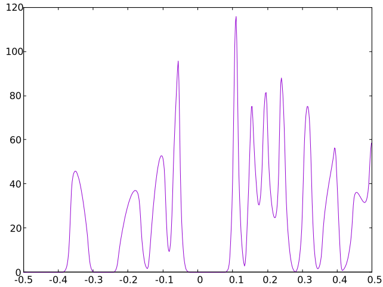
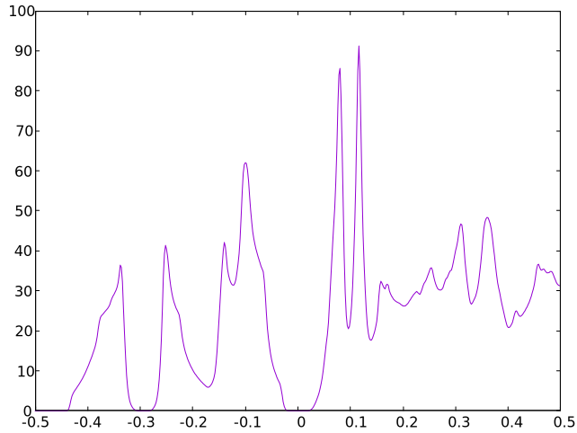
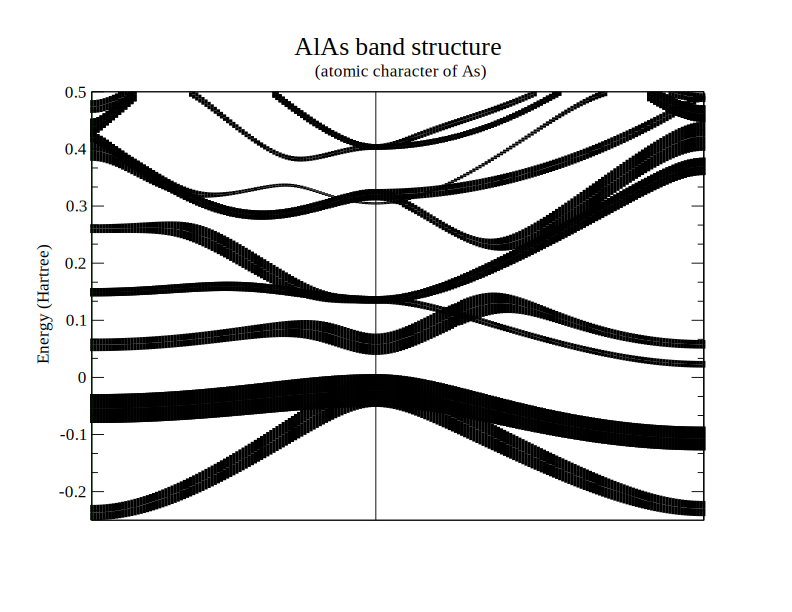

# 状態密度とバンド構造図

## 状態密度図

固体材料の第一原理計算における、最初の実行に適した（簡単な）例題の代表例がシリコン単結晶（ダイヤモンド構造）です。
Elkにもサンプルが付属していますが、そこには状態密度計算が含まれません。
`examples/basic/Si`
簡単な変更で状態密度を計算できますので、それを試します。

入力ファイル`elk.in`にて、計算内容を`tasks`で指定します。
マニュアルを参照すると、状態密度の計算は`10`の

> Total, partial and interstitial density of states (DOS).

であることがわかります。

`tasks`の`0`は、原則として常に利用します。

> Ground-state run starting from the atomic densities.

`0`で電子状態を求めた後に、`10`で状態密度を計算するためには、それらを順番に記述します。

```C
tasks
  0
  10
```

計算実行すると、たくさんのファイルが出力されます。
状態密度計算結果は、`TDOS.OUT`です。
エネルギーと状態密度の二列のデータが並んだ、テキスト形式のファイルです。
Gnuplotで描画すると、下図のようになりました。



エネルギー（横軸）の単位はHartreeです。
シリコンの状態密度の雰囲気はありますが、教科書等で見かけるものと同じとは言い難いです。

その主たる原因は、計算精度が低いことです。
k点分割を増やすだけで、見た目は大幅に改善します。

入力ファイル中のk点分割指定

```C
ngridk
  2  2  2
```

を

```C
ngridk
  4  4  4
```

に変換して再計算した結果を、下図に示します。



シリコンの状態密度らしくなりました。

## バンド構造図

同じくサンプル`examples/basic/Si`を実行して、バンド構造図を作成します。

入力ファイル`elk.in`にて、`tasks`の`20`は

> Band structure plot.

です。
これは最初からサンプルに書き込まれています。

そして以下の記述が、バンド構造を計算するk点の経路情報です。
プリルアンゾーンの対称性が高い点を7つ指定しています。

```C
plot1d
  7 200                                 : nvp1d, npp1d
  0.0   0.0   1.0                       : vlvp1d
  0.5   0.5   1.0
  0.0   0.0   0.0
  0.5   0.0   0.0
  0.5   0.5   0.0
  0.5   0.25 -0.25
  0.5   0.0   0.0
```

電子状態計算はこのままで実行できますが、
以下の手順でバンド構造を描画する際には、k点座標に名前（記号）を与える必要があります。
面心立方格子の対称点`(1/2, 0, 0)`の名称がわからなかったので、仮に`Z`としました。
また、`~G`は描画時に`Γ`に変換されます。

```C
plot1d
  7 200                                 : nvp1d, npp1d
  0.0   0.0   1.0    ~G                 : vlvp1d
  0.5   0.5   1.0    X
  0.0   0.0   0.0    ~G
  0.5   0.0   0.0    Z
  0.5   0.5   0.0    X
  0.5   0.25 -0.25   W
  0.5   0.0   0.0    Z
```

実行すると、200個のk点について計算します。

電子状態計算の後、以下のコマンドを実行すると、バンド構造図の画像ファイル`elk-bands.eps`が生成されます。

```sh
../../../utilities/elk-bands/elk-bands
```


エネルギー（縦軸）原点は、フェルミエネルギーだと思います。
それが価電子帯上端よりも上に位置しているのは、サンプリングk点をシフトしているため、です。
入力ファイル`elk.in`から下記設定を削除すると、エネルギー原点はバンドギャップ内に位置するようになります。

```C
vkloff
  0.25  0.5  0.625
```

## 射影バンド図

サンプル`examples/basic/AlAs-fatbands`は、射影バンド図を題材にしています。

`tasks`の`21`を使います。

> Band structure plot which includes total and angular momentum characters for every atom.

電子状態計算実行後、入力ファイル`elk.in`に書かれている通りに下記コマンドを実行するとグラフが表示されます。

```sh
xmgrace -settype xydy BAND_S02_A0001.OUT -settype xy BANDLINES.OUT -param AlAs.par
```



`xmgrace`は[Grace](https://plasma-gate.weizmann.ac.il/Grace/)のGUIコマンドです。
なければ、追加インストールしてください。
