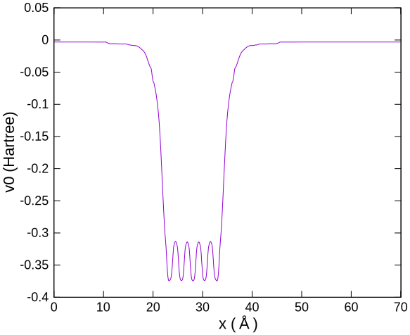
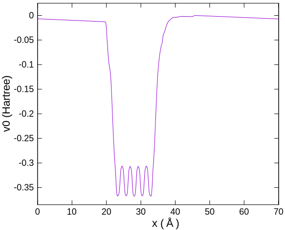
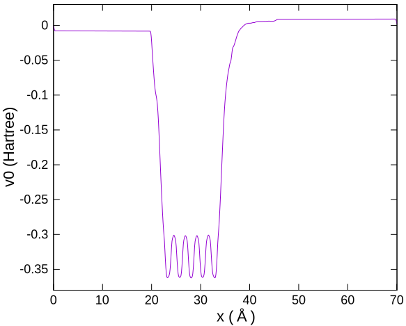

# 仕事関数

## 概要

OpenMXでも表面の解析には、スラブモデルを用います。
この際、OpenMXは原子位置に局在した基底関数を採用していますので、平面波基底を用いる計算手法とは異なり、表面から染み出した電子状態を精度良く記述するためには工夫が必要です。
その工夫は**空（ダミー）原子**を配置することです。
空原子には、原子核に相当する正電荷も、価電子もありませんが、基底関数はあるので、原子が存在しない位置で電子状態の記述を補強します。

## 入力ファイルと計算実行

`Al111_Workfunc_0E.dat`などは、5層の（実）原子から成るAl (111)面のスラブモデルの計算入力ファイルです。
表面垂直方向がx軸に一致しています。
`?E`の数値が、空原子層の数を示します。

```sh
mpiexec -np 2 ../opnemx Al111_WorkFunc_0E.dat
```

ポテンシャルの三次元分布が、`Al111_WorkFunc_0E.v0.cube`などに出力されます。
これをy-z面内で平均して、表面垂直（x軸）方向のポテンシャル変化を得ます。

```sh
gcube2oned 1 Al111_WorkFunc_0E.v0.cube > 1d_pot0E.txt
```

## 結果解析

表面に垂直な面内で平均したポテンシャルの、表面垂直方向依存性を下図に示します。
表面から十分に離れたところ（70A周辺）では、v0はほぼゼロになっています。
これが真空準位です。


一方、フェルミエネルギーは`Chemical Potential`として、`Al111_WorkFunc_0E.out`などに書き出されています。

```sh
$ grep Chemical Al111_WorkFunc_0E.out
  Chemical potential (Hartree)      -0.135234894508
   Chemical Potential (Hartree) =  -0.13523489450767
```

真空準位とフェルミエネルギーの差が、仕事関数です。
Al (111)面5層モデルについて、仕事関数の空原子層数依存性を下表に示します。

| 空層数 | 仕事関数 (eV) |
| :----------: | :----------: |
| 0 | 3.70 |
| 2 | 4.19 |
| 4 | 4.19 |
| 6 | 4.19 |

空原子に原子層程度で、仕事関数は収束するようです。

## ESM法の効果確認

サンプル入力ファイルでは、「周期的スラブ間の相互作用を回避するため」にESM法が有効になっています。
その効果を確認するために、ESM法を`off`にした計算を試みました。
スラブの両面に空原子を４層ずつ配置して求めたポテンシャルを下図に示します。



仕事関数は4.18 eVと求まり、ESM法の効果は実感できません。

ESM法が効果を発揮するのは、スラブに**分極**が生じた場合です。
Al (111)面では、スラブの両面（表面と裏面）が等価ですので分極を生じませんが、例えばウルツ鉱型の(0001)面のように表面と裏面が異なれば、一般に分極を生じます。
そして周期境界条件の下で、周期的に整列した分極は相互作用します。
この相互作用は、計算手法の都合で人為的に導入されたものであり、実在しません。
OpenMXのマニュアルに記載されている

> ここで周期的スラブ間の相互作用を回避するため「ESM.switch=on1」が使われます。

は、この実在しない相互作用を排除するためにESM法が有効であることを述べています。

ESM法の効果を確認するために、Al (111)面のサンプルに細工をして、スラブに分極を生じさせます。
表面近傍の電子状態を正しく記述するためには、空原子が必要であることを先に確認しました。
スラブの両側（表面と裏面）に等しく空原子を配置した場合には分極を生じませんが、片側（表面）のみに空原子を配置するとバランスが崩れて分極が発生します。

[Al111_WorkFunc_oneside4E.dat](./Al111_WorkFunc_oneside4E.dat)

表面に垂直な面内で平均したポテンシャルの表面垂直方向依存性は以下のようになりました。
スラブから離れた場所でポテンシャルが傾いていることは、電場が存在することを示しています。
その電場の原因は、スラブに生じた分極です。



ESM法を有効にしてポテンシャルを計算し直すと以下のようになります。
スラブから離れた位置で、ポテンシャルが水平になり、すなわち電場はなくなりました。
その代償として、格子の境界x=0 (70.13)でポテンシャルが（不連続的に）変化します；平坦部のポテンシャルは、x=0付近では-0.0078、x=70付近では0.0092 Hartreeです。
空原子を配置して、表面近傍の電子状態を正しく求めたのはスラブの右側です。
そこで、x=70付近でのポテンシャルエネルギーを真空準位として、それとフェルミエネルギーの差から仕事関数を求めると、4.17 eVでした。


