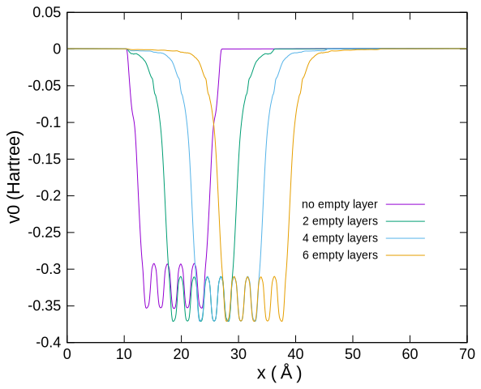

# 仕事関数

## 概要

OpenMXでも表面の解析には、スラブモデルを用います。
この際、OpenMXは原子位置に局在した基底関数を採用していますので、平面波基底を用いる計算手法とは異なり、表面から染み出した電子状態を精度良く記述するためには工夫が必要です。
その工夫は**空（ダミー）原子**を配置することです。
空原子には、原子核に相当する正電荷も、価電子もありませんが、基底関数はあるので、原子が存在しない位置で電子状態の記述を補強します。

## 入力ファイルと計算実行

`Al111_Workfunc_0E.dat`などは、5層の（実）原子から成るAl (111)面のスラブモデルの計算入力ファイルです。
表面垂直方向がx軸に一致しています。
`?E`の数値が、空原子層の数を示します。

```sh
mpiexec -np 2 ../opnemx Al111_WorkFunc_0E.dat
```

ポテンシャルの三次元分布が、`Al111_WorkFunc_0E.v0.cube`などに出力されます。
これをy-z面内で平均して、表面垂直（x軸）方向のポテンシャル変化を得ます。

```sh
gcube2oned 1 Al111_WorkFunc_0E.v0.cube > 1d_pot0E.txt
```

## 結果解析

表面垂直方向のポテンシャル変化を下図に示します。
表面から十分に離れたところ（70A周辺）では、v0はほぼゼロになっています。
これが真空準位です。



一方、フェルミエネルギーは`Chemical Potential`として、`Al111_WorkFunc_0E.out`などに書き出されています。

```sh
$ grep Chemical Al111_WorkFunc_0E.out
  Chemical potential (Hartree)      -0.135234894508
   Chemical Potential (Hartree) =  -0.13523489450767
```

真空準位とフェルミエネルギーの差が、仕事関数です。
Al (111)面5層モデルについて、仕事関数の空原子層数依存性を下表に示します。

| 空層数 | 仕事関数 (eV) |
| :----------: | :----------: |
| 0 | 3.70 |
| 2 | 4.19 |
| 4 | 4.19 |
| 6 | 4.19 |

空原子に原子層程度で、仕事関数は収束するようです。