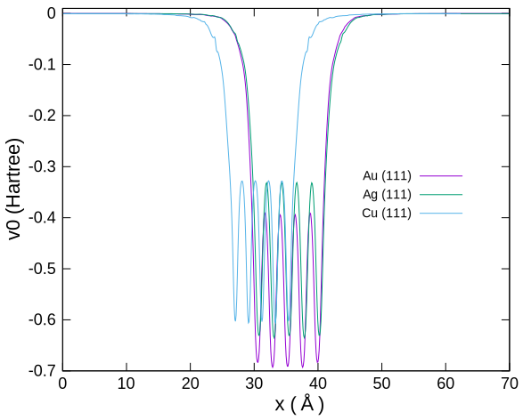

# 仕事関数

## 銅、銀、金の仕事関数

その他金属の仕事関数入力ファイルが用意されていますので、これらを試します。
それぞれ7層の空原子が設定されています。

- 銅：`Cu111_WorkFunc_7E.dat`
- 銀：`Ag111_WorkFunc_7E.dat`
- 金：`Au111_WorkFunc_7E.dat`

表面垂直方向のポテンシャル変化を下図に示します。
いずれも表面から十分に離れたところ（70A周辺）では、v0はほぼゼロになっています。

出力ファイルからフェルミエネルギーを読み取り、仕事関数を求めます。

|  | 仕事関数 (eV) |
| :-------: | :-------: |
| Cu | 4.74 |
| Ag | 4.51 |
| Au | 5.33 |
