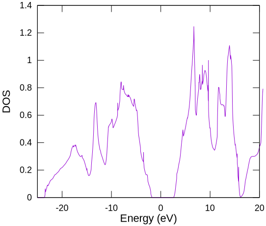

# ダイヤモンド

## 原子配置の設定

ダイヤモンドを、面心立方基本格子で計算します。
入力ファイルは`work/Cdia.dat`です。
格子定数は3.56Å（Bravais格子）です。
格子長さを基準にして、(0, 0, 0)と(1/4, 1/4, 1/4)の位置に炭素原子があります。
炭素の価電子数は4です。
スピン分極はなく、アップスピンとダウンスピンに2個ずつの電子を各原子に詰めます。

```C
Atoms.Number         2
Atoms.SpeciesAndCoordinates.Unit   Ang # Ang|AU
<Atoms.SpeciesAndCoordinates
 1  C  0.000  0.000  0.000   2.0 2.0
 2  C  0.890  0.890  0.890   2.0 2.0
Atoms.SpeciesAndCoordinates>
Atoms.UnitVectors.Unit             Ang # Ang|AU
<Atoms.UnitVectors
   1.7800  1.7800  0.0000
   1.7800  0.0000  1.7800
   0.0000  1.7800  1.7800
Atoms.UnitVectors>
```

## 状態密度計算

入力ファイルには下記設定が含まれるので、実行すると状態密度計算に必要なファイルが出力されます。

```C
Dos.fileout                  on        # on|off, default=off
Dos.Erange              -25.0  20.0    # default = -20 20
Dos.Kgrid                12 12 12      # default = Kgrid1 Kgrid2 Kgrid3
FermiSurfer.fileout          on
```

出力される二つのファイル

- `cdia.Dos.val`
- `cdia.Dos.vec`

を、`DosMain`プログラムで処理します。

```sh
./DosMain cdia.Dos.val cdia.Dos.vec
```

四面体法で全状態密度を計算すると、その結果が`cdia.DOS.Tetrahedron`に書き出されます。

```sh
$ gnuplot
gnuplot > plot 'cdia.Dos.Tetrahedron'
```

```sh
gnuplot plot-dos.gpi
```



フェルミエネルギー（エネルギーの原点）は、バンドギャップの中央に設定されるようです。
