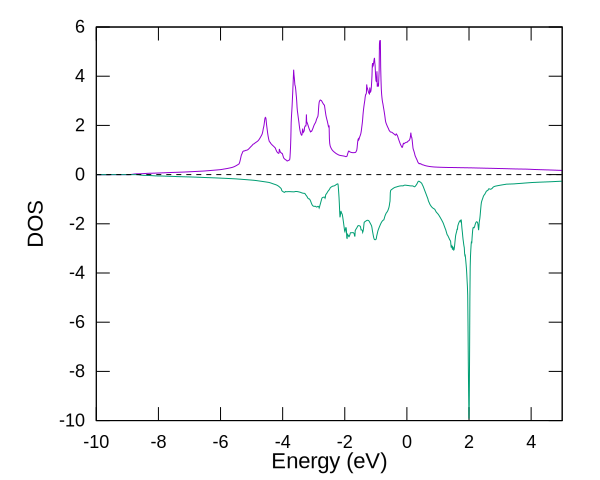
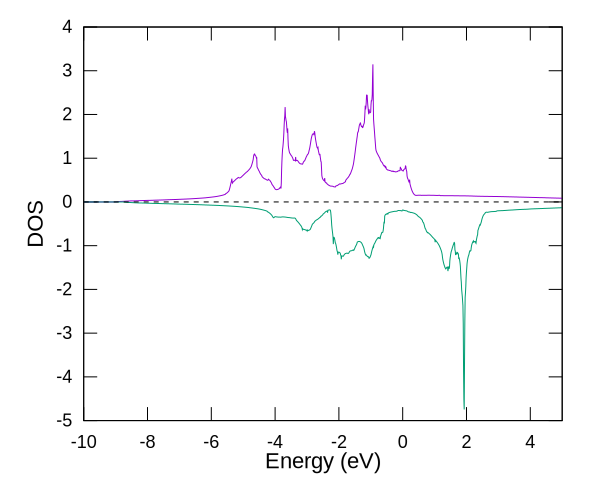

# 体心立方鉄

## 概要

スピンを考慮した例として、体心立方鉄の計算を行います。
サンプル入力ファイルは`Febcc2.dat`です。

## Bravais格子での計算

立方体の実格子内に2個の原子を含む、Bravais格子での計算です。

Fe原子一つあたり14個の価電子を、アップスピンに8個、ダウンスピンに6個割り当てた状態から計算を開始します。

```C
<Atoms.SpeciesAndCoordinates
 1  Fe  0.0000    0.0000    0.0000     8.0 6.0
 2  Fe  0.5000    0.5000    0.5000     8.0 6.0
Atoms.SpeciesAndCoordinates>
```

サンプルファイルそのままでは状態密度を計算しないので、以下の記述を追加してから計算実行します。

```C
Dos.fileout                  on        # on|off, default=off
Dos.Erange              -10.0  5.0     # default = -20 20
Dos.Kgrid                12 12 12      # default = Kgrid1 Kgrid2 Kgrid3
```

```sh
mpiexec -n 2 ./openmx ./Febcc2.dat
```

出力ファイル`fe.out`から、全エネルギーを読み取ります。

```C
  Utot.       -179.142122856474
```

この値単独から物理的な意味は読み取れませんが、後で計算する系とのエネルギー比較に用います。

状態密度図を描画するために、計算結果を加工（後処理）します。

```sh
./DosMain fe.Dos.val fe.Dos.vec
```

四面体法で全状態密度を計算すると、結果は`fe.DOS.Tetrahedron`に出力されます。
その書式は、5カラムの数値データで構成されています。
1カラム目がエネルギーです。
その原点は**フェルミエネルギー**、単位はeVです。
2, 3カラム目は、アップスピンとダウンスピンそれぞれの状態密度です。
ダウンスピンは状態密度が「負」の値として書き出されています。
そのままグラフ描画すると、アップスピンの状態密度がy軸正の方向に、ダウンスピンの状態密度はy軸負の方向に描画されます。



残る4, 5カラム目は、アップスピンとダウンスピンそれぞれの、そのエネルギーまでの状態密度積分値です。

## 基本格子での計算

付属サンプルはBravais格子での計算ですが、体心立方格子の基本格子を利用しても等価な計算になることを確認します。
入力ファイルの変更箇所を以下に示します。

- 格子内の原子は一つだけ。原点に配置します。
- 基本格子のベクトルを与えます。
- 実格子が小さくなった分、逆格子は大きくなりますので、それを補うようにk点分割数を増やします。

```diff
--- Febcc2.dat	2022-06-24 23:01:54.000000000 +0900
+++ Febcc1.dat	2022-06-24 23:01:47.000000000 +0900
@@ -3,7 +3,7 @@
 #

 System.CurrrentDirectory         ./    # default=./
-System.Name                      fe
+System.Name                      fep
 level.of.stdout                   1    # default=1 (1-3)
 level.of.fileout                  0    # default=1 (1-3)

@@ -20,18 +20,17 @@ Definition.of.Atomic.Species>
 # Atoms
 #

-Atoms.Number         2
+Atoms.Number         1
 Atoms.SpeciesAndCoordinates.Unit   FRAC  # Ang|AU
 <Atoms.SpeciesAndCoordinates
  1  Fe  0.0000    0.0000    0.0000     8.0 6.0
- 2  Fe  0.5000    0.5000    0.5000     8.0 6.0
 Atoms.SpeciesAndCoordinates>

 Atoms.UnitVectors.Unit             Ang # Ang|AU
 <Atoms.UnitVectors
-   2.7839  0.0000   0.0000
-   0.0000  2.7839   0.0000
-   0.0000  0.0000   2.7839
+  -1.39195   1.39195   1.39195
+   1.39195  -1.39195   1.39195
+   1.39195   1.39195  -1.39195
 Atoms.UnitVectors>

 #
@@ -45,7 +44,7 @@ scf.ElectronicTemperature  300.0       #
 scf.Ngrid                 32 32 32
 scf.maxIter                 100        # default=40
 scf.EigenvalueSolver      band         # Recursion|Cluster|Band
-scf.Kgrid                 11 11 11     # means n1 x n2 x n3
+scf.Kgrid                 15 15 15     # means n1 x n2 x n3
 scf.Mixing.Type            rmm-diisk   # Simple|Rmm-Diis|Gr-Pulay
 scf.Init.Mixing.Weight     0.020       # default=0.30
 scf.Min.Mixing.Weight      0.001       # default=0.001
@@ -69,4 +68,4 @@ MD.Opt.criterion         1.0e-5        #

 Dos.fileout                  on        # on|off, default=off
 Dos.Erange              -10.0  5.0    # default = -20 20
-Dos.Kgrid                12 12 12      # default = Kgrid1 Kgrid2 Kgrid3
+Dos.Kgrid                16 16 16      # default = Kgrid1 Kgrid2 Kgrid3
```

[変更後のファイル](./Febcc1.dat)

```sh
mpiexec -n 2 ./openmx ./Febcc1.dat
```

出力ファイル`fep.out`から全エネルギーを読み取ります。

```C
  Utot.        -89.570841584631
```

先ほどのBravais格子での2原子分のエネルギーのほぼ半分になっていますので、等価な計算とみなせるでしょう。
状態密度も同じように計算されています。

