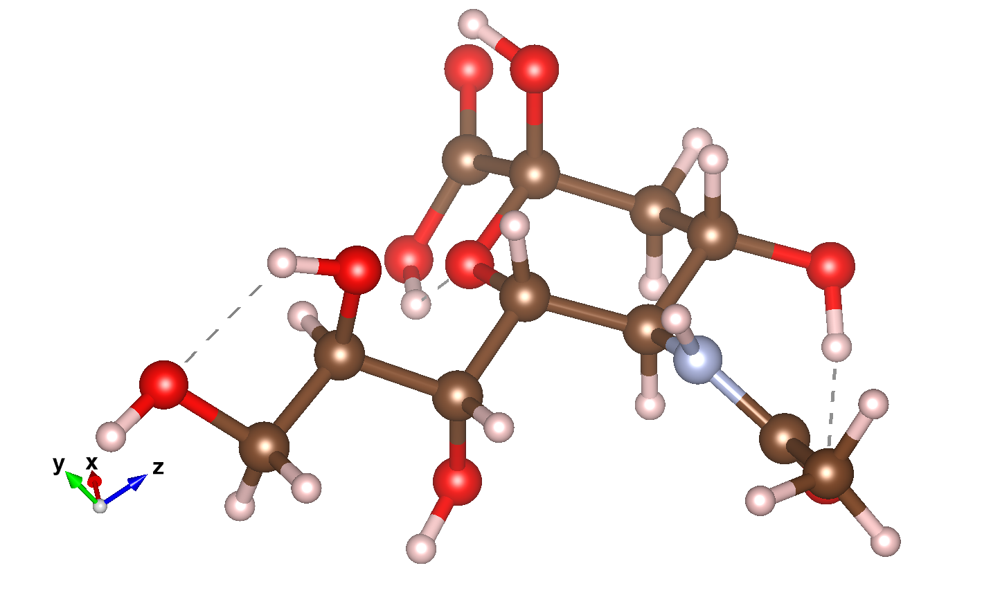

# シアル酸（Sialic Acid）

## 概要

孤立系の例として、分子を計算します。

いくつかのサンプルが用意されている中で、[シアル酸](https://ja.wikipedia.org/wiki/シアル酸)を選びます。



C<sub>11</sub>H<sub>19</sub>NO<sub>9</sub>

原子位置固定の計算に加えて、原子位置を最適化する計算の入力ファイルが用意されています。
複数の構造最適化手法が用意されている中で、マニュアルによると`EF` (Eigenvector Following)法が最も効率良いとのことですので、同法を試みます。

入力ファイルは`work/geoopt_example/SialicAcid_EF.dat`です。

## 入力ファイル説明

総原子数は`40`、各原子位置はオングストローム単位の直交座標で与えられています。

```sh
Atoms.Number        40
Atoms.SpeciesAndCoordinates.Unit   Ang # Ang|AU
<Atoms.SpeciesAndCoordinates           # Unit=Ang.
  1    C      2.582389    0.082263    0.275981  2.0 2.0
  2    C      2.373302   -1.138641    1.194045  2.0 2.0
  3    C      1.025279   -1.046303    1.915805  2.0 2.0
  4    O      1.494760    0.417412   -0.551026  3.0 3.0
  5    O      2.737365    1.290409    0.959881  3.0 3.0

        ...

 38    H     -2.737481    2.157517   -2.640910  0.5 0.5
 39    H     -0.814953    3.755808   -1.157336  0.5 0.5
 40    H     -2.005246    3.361919   -4.386353  0.5 0.5
Atoms.SpeciesAndCoordinates>
```

各行で、原子の順番、元素記号、x, y, z座標に続くのは電荷です。
スピン自由度を考慮しないので、アップスピンとダウンスピンに均等に価電子を割り当てます。
価電子が奇数個の`N`と`H`は、電子を半分にして`0.5`単位で指定します。

格子の指定は省略（コメントアウト）されています。

```sh
Atoms.UnitVectors.Unit             Ang #  Ang|AU
#<Atoms.UnitVectors
#  16.0   0.0   0.0
#   0.0  14.0   0.0
#   0.0   0.0  15.0
#Atoms.UnitVectors>
```

基底関数が重ならない大きさの格子が自動的に用意されます。

孤立系に対しては`scf.EigenvalueSolver`に`cluster`を指定します。

```sh
scf.EigenvalueSolver       cluster     # Recursion|Cluster|Band
```

k点分割`scf.Kgrid`は`1 1 1`で良いでしょう。

構造最適化手法には、`EF`が指定されています。

```sh
MD.Type                     EF         # Nomd|Opt|NVE|NVT_VS|NVT_NH
```

## 計算実行

入力ファイルで基底関数のディレクトリを指定しない場合は、既定値`../DFT_DATA19/`が用いられます。
これに対応するために、`geoopt_example`ディレクトリにある入力ファイルを一階層上にコピーします。

```sh
cp SialicAcid_EF.dat ..
cd ..
```

MPI並列で計算実行します。

```sh
mpiexec -np 2 ./openmx SialicAcid_EF.dat
```

## 結果確認

計算終了すると、多くのファイルが出力されています。

各ステップの原子位置は、`SialicAcid_EF.md`に書き出されています。[OpenMX Viewer](http://www.openmx-square.org/viewer/index.html)で可視化できます。
その他に収束した（最終フレームの）原子配置が、以下のファイルに出力されています。

- SialicAcid_EF.xyz
- SialicAcid_EF.cif
- SialicAcid_EF.md2

孤立系については、`xyz`をVESTAで可視化するのがわかりやすいでしょう。
他方、`xyz`フォーマットには格子の情報が含まれないので、結晶（周期系）の描画には適しません。

なお、結晶の原子配置の描画には、格子の情報を含む`cif`が適しています。
しかしながらこの例では、OpenMX Viewerは、全ての原子を格子内部に収めようとして、座標値が負の原子が格子境界を跨いだ格子の反対側に描画され、分子がバラバラに表示されてしまいます。
VESTAも同じように周期境界条件を考慮しますが、境界の少し外側の原子まで描画する性質があり、格子の全ての隅に分子が表示されます。

構造最適化の履歴は`SialicAcid_EF.out`に出力されています。

```sh
***********************************************************
***********************************************************
              History of geometry optimization
***********************************************************
***********************************************************

  MD_iter   SD_scaling     |Maximum force|   Maximum step        Utot
                           (Hartree/Bohr)        (Ang)         (Hartree)

    1       1.25981732       0.17266687       0.10583545    -231.21049706
    2       1.25981732       0.12161705       0.08107803    -231.26202039
    3       1.25981732       0.07885287       0.05256858    -231.28439280
    4       1.25981732       0.06314377       0.04209585    -231.29123842
    5       3.14954331       0.04158864       0.06931440    -231.29626451
    6       1.57477166       0.09576138       0.07980115    -231.29400564
    7       1.57477166       0.08734582       0.07278818    -231.29812082

    ...

   91       4.92116143       0.00016480       0.00646161    -231.33329398
   92       4.92116143       0.00023710       0.00411664    -231.33329734
   93       4.92116143       0.00018146       0.00675069    -231.33329939
   94       4.92116143       0.00008933       0.00000000    -231.33330241
```

最後の列がエネルギーです。
構造緩和が進むに従って、エネルギーが小さくなることが確認できます。

同ファイルには、マリケン電荷と電気双極子モーメントも書き出されています。

```sh
***********************************************************
***********************************************************
                   Mulliken populations
***********************************************************
***********************************************************

  Total spin moment (muB)   0.000000000

                    Up spin      Down spin     Sum           Diff
      1    C      1.915329296  1.915329296   3.830658593   0.000000000
      2    C      2.250310419  2.250310419   4.500620838   0.000000000
      3    C      2.088990004  2.088990004   4.177980009   0.000000000
      4    O      3.153230758  3.153230758   6.306461516   0.000000000
      5    O      3.224511947  3.224511947   6.449023895   0.000000000

    ...
```

```sh
***********************************************************
***********************************************************
                    Dipole moment (Debye)
***********************************************************
***********************************************************

 Absolute D       12.28659686

                      Dx                Dy                Dz
 Total            -10.78085311        4.75967402       -3.47551029
 Core             225.66778867      -28.13168867      -40.50158345
 Electron        -236.44864178       32.89136269       37.02607316
 Back ground       -0.00000000       -0.00000000        0.00000000

```
