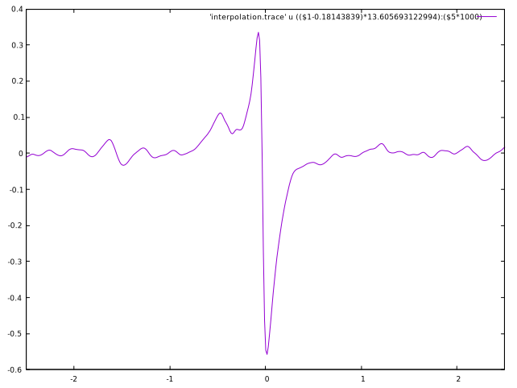

# BoltzTraP2による解析

BoltzTraPは、電子状態計算結果とボルツマン方程式を組み合わせて、輸送係数を求めます。
熱電材料の研究においては、標準的な解析方法として認知されています。

BolzTraPには、同一の作者によるバージョン1と2が存在します。
互換性はありません。
作者が[BoltzTraP2](https://www.tuwien.at/en/tch/tc/theoretical-materials-chemistry/boltztrap2)の利用を勧めていますので、そちらを利用します。
インストールは[こちら](https://github.com/matelier/moku-moku/blob/master/tools/BoltzTraP2/README.md)を参照してください。

## PHASE/0による電子状態計算

`2023.01`に付属のサンプル`samples/BoltzTraP/CoSb3`を実行します。
格子定数、格子内部の原子配置を求めるまでは、通常の手続きで進めてください。

電荷密度固定計算（固定電荷計算）で状態密度を計算します。
この時、バンド数およびk点分割数を大きく設定します。
入力ファイルの後処理にBoltzTraP2向けの設定を追加します。

```C
postprocessing{
    boltztrap{
        sw_boltztrap = on
        version = 2
    }
}
```

用意されている電荷密度固定計算の入力ファイルでは、バンド数が不足気味です。
計算実行に支障ありませんが、物理的に適切な（収束した）結果を得ることができません。

バンド数を増やすのも一つの方法ですが、ここでは擬ポテンシャルを変更します。
サンプルで指定されているSbの擬ポテンシャルは4d電子を価電子として含みます（価電子数15）。
状態密度を計算するとわかりますが、Sbの4d電子はCoと混成しません。
ですからCoSb<sub>3</sub>の計算においては、Sbの4d電子を内殻電子として扱っても良さそうです。
公開されているもう一つの擬ポテンシャル`Sb_ggapbe_paw_us_02.pp`は、4d電子を価電子に含まず、価電子数は5です。
こちらの価電子数が少ない擬ポテンシャルを使えば、入力ファイルに記載されているバンド数は適切です。

以下では、擬ポテンシャルを変更して計算実行した結果を用いて説明します。

## BoltzTrap2を利用した結果解析

サンプル`samples/BoltzTraP/CoSb3`には、電荷密度固定計算のディレクトリがk点分割数を変えて、複数用意されています。
それら代表して、`fc_10x10x10`を取り上げます。
電荷密度固定計算を終えると、PHASE/0からBoltzTraP2に渡すデータファイルが二つ生成されます。

- fc_10x10x10.energy
- fc_10x10x10.structure

ファイル名の`fc_10x10x10`の部分は、計算したディレクトリ名と同一です。

BoltzTraP2は、`btp2`コマンドにサブコマンドを与えて利用します。
最初に実行すべきは、補間です。
`samples/BoltzTraP/CoSb3`ディレクトリ（`fc_10x10x10`の一階層上）にて、次のコマンドを実行します。

```sh
btp2 interpolate -m 4 fc_10x10x10
```

`-m`の後の数値（この例では`4`）で、補間の細かさを指定します。
数値が大きいほど、細かく補間します。
補間結果は、ファイル`interpolation.bt2`に書き出されます。

次にこのファイルを使って、物理量を計算します。
例えば、300Kでの各種物理量を得るには、下記コマンドを実行します。

```sh
btp2 integrate interpolation.bt2 300:400:100
```

複数のファイルが書き出されますが、最も重要なファイルは`interpolation.trace`です。
ファイルの一行目に説明がある通り、一列目がエネルギー（Rydberg単位）、五列目がゼーベック係数（V/K単位）です。
ここで、エネルギーの原点に注意が必要です。
エネルギー原点はPHASE/0内部処理の都合で決められており、現実と直接対応する数値ではありません。
物理現象の解釈には、フェルミエネルギーを基準にすると便利ですので、原点を補正します。
フェルミエネルギーを、価電子帯上端(VBM)と伝導帯下端(CBM)の真ん中と仮定します。
VBMとCBMは、PHASE/0出力`fc_10x10x10/output000`ファイルから読み取ります。

```
--- The system is insulating or semiconducting ---
--- The highest  occupied band energy (=vbm) =   0.08649947
        lowest unoccupied band energy (=cbm) =   0.09493892
                          estimated band gap =   0.00843945 Ha   (   0.22964907 eV )

--- efermi =   0.0907
```

`0.08649947`と`0.09493892`の平均値の`0.090719195`がフェルミエネルギーです。
同じく`fc_10x10x10/output000`ファイルに出力されている`efermi`とは異なる値であることにご注意ください。
また、PHASE/0はエネルギーの内部表現にHartree単位を用いています。
BoltzTraP2の出力はRydberg単位を用いていますので、先の数値を二倍して単位をそろえます。（1 Hartree = 2 Rydberg）

エネルギー原点をフェルミエネルギーにしてからeV単位に変換して、グラフを描画します。

```sh
gnuplot
gnuplot> set xrange[-2.5:2.5]
gnuplot> plot 'interpolation.trace' u (($1-0.18143839)*13.605693122994):($5*1000) w l
```

縦軸単位を`mV/K`に変換しました。



ゼーベック係数は、k点分割数に対する収束性が良くありません。
大きめのk点分割数を採用し、かつ、k点分割数依存性を評価して収束を確認することが望ましいです。
k点分割数が異なるサンプル`fc_5x5x5`, `fc_20x20x20`, `fc_30x30x30`も用意されていますのでお試しください。
さらに、先に実行した`interpolate`サブコマンドによる補間も、収束性に影響を及ぼすと考えられます。
