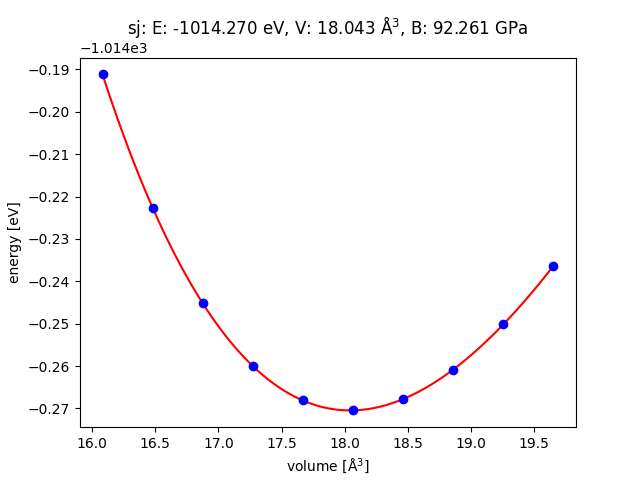

# ASEからPHASE/0を実行する

## はじめに

[ASE](https://wiki.fysik.dtu.dk/ase/)は、様々な原子スケールシミュレーションソフトウェアをPythonで制御するためのインターフェースを提供します。

## インストール

ASEのPHASE/0インターフェースが最後に公開されたのは2020年1月です。
ASEとそれが利用するライブラリ類は新しいバージョンがリリースされていますが、PHASE/0インターフェースはそれらアップデートに対応（追従）していません。
（コード修正なしに）そのまま動かすためには、少し古いバージョンのライブラリを利用します。

RHELは安定運用を重視したディストリビューションですので、各種ソフトウェアのバージョンアップに慎重な傾向があり、少々古いバージョンのソフトウェアを動作させる環境として適しています。
ここでは、その互換ディストリビューションであるRocky Linux 9を使います。
WSLで動作させる手順は、[こちら](../../installation/wsl_rocky_oneapi.md)を参照してください。

標準のPythonのバージョンは3.9です。

ASE以外では最新のライブラリ類を使う（意図的に古いバージョンを使わない）可能性に配慮して、Python仮想環境を用意します。

```
python -m venv phase0ase
```

`phase0ase`は名前なので、お好みの文字列を選んでください。
下記コマンドで仮想環境を有効化します。

```
. ~/phase0ase/bin/activate
```

仮想環境下でインストールしたPythonライブラリ類は、当該仮想環境内でのみ有効です。
ASEを、バージョンを指定してインストールします。

```
pip install ase==3.18.1 numpy==1.19.5 scipy==1.10.1 matplotlib==3.6.3
```

このようにしてインストールしたASEの実体は`$HOME/phase0ase/lib/python3.9/site-packages/ase/`以下に格納されます。
この「公式に配布されている」ASEは、PHASE/0に未対応です。
PHASE/0に対応させるためには、PHASEシステム研究会から配布されている差分を適用（ファイルを上書き）します。

```sh
cd phase0_ase
cp -r ase ~/phase0ase/lib/python3.9/site-packages/
```

以上でPHASE/0とのインターフェースを備えたASEのインストールが完了しました。

## 環境設定

ASEでのPHASE/0実行時に二つの環境変数を参照します。
例えば以下のように設定します。

```sh
export ASE_PHASE0_COMMAND="mpiexec -n 2 $HOME/phase0_2023.01/bin/phase"
export PHASE_PP_PATH=$HOME/phase_pp_paw_2014
```

前者はPHASE/0（`phase`コマンド）を並列実行するためのコマンド、後者は擬ポテンシャルファイルが格納されているディレクトリを与えます。

また、（ASEを使用する）ログインの度に仮想環境を有効にすることを忘れないでください。

```sh
. ~/phase0ase/bin/activate
```

## サンプル実行

付属サンプル`phase0_ase/samples/Ag_eos`を実行してみましょう。
これは、Ag（面心立方格子）のE-V曲線を計算します。

```sh
./Ag.py
```

実行結果は下図のようになりました。

]