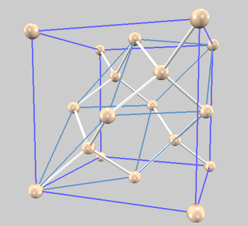
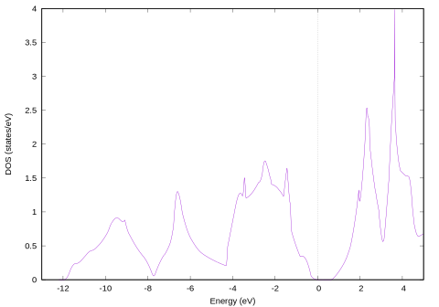
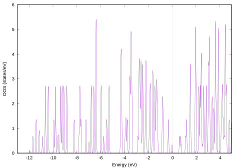
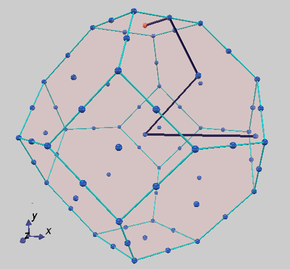
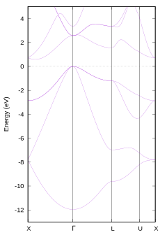

シリコン単結晶（基本格子）
=

一番最初に取り組む課題に適しています。
4個の実行例を含み、その計算実行手順はサンプル内`basic/Si2/README`に説明されています。

# 概要

最も簡単な計算として、シリコン単結晶を扱います。

PHASE/0は、周期境界条件下での原子の集団を扱います。
基本となる繰り返し構造の単位が小さいほど計算負荷が軽いので、規則正しく原子が並んだ構造、すなわち結晶の扱いに長けています。
このような計算手法は、半導体を筆頭とした固体物理分野を中心に発達してきました。

シリコン単結晶はダイヤモンド構造をしており、そのBravais格子（立方体）は8原子で構成されます。
その原子配置を下図に示します。



一見して原子数が多いですが、格子境界の原子を重複して描画していることが理由です。
Bravais格子内の独立な原子は8個です。

ところで、 ダイヤモンド構造のBravais格子は三次元繰り返しの最小単位ではありません。
三次元の繰り返しの最小単位は**基本格子**と呼ばれ、ダイヤモンド構造（面心格子）の場合は、立方体の内部に水色で描画された平行六面体です。
この基本格子の体積は、Bravais格子の1/4であり、2個の原子を含みます。
これが縦・横・高さ方向に繰り返し配置されているとみなして、無限に大きな「結晶」を扱います。

なおPHASE/0では、空間反転対称性（反転中心は座標原点）を利用すると、計算負荷を削減できます。
この性質を利用できるように、サンプル入力ファイルでは原子を平行移動させた配置が採用されています。


# SCF計算（scf）

安定な原子配置、全エネルギーなどを求める計算です。
この計算で得られた電荷密度分布を、バンド構造図など後の計算で利用します。

入力ファイルは、`file_names.data`と`nfinp.data`の二つです。
前者は主に擬ポテンシャルの指定に利用し、詳細な計算条件は後者で設定します。

それでは`nfinp.data`の内容を見てみましょう。

繰り返しの単位となる格子は、基本格子が三次元ベクトル表記で与えられています。
```
unit_cell_type = primitive
unit_cell{
    a_vector =  0.0000000000        5.1300000000        5.1300000000
    b_vector =  5.1300000000        0.0000000000        5.1300000000
    c_vector =  5.1300000000        5.1300000000        0.0000000000
}
```
長さの単位は、既定値のBohrです。

入力ファイルではBravais格子を与えて、基本格子で計算する設定はを参照してください。

対称性は`diamond`が指定されています。
```
symmetry{
    crystal_structure = diamond
}
```
この指定は汎用性に乏しいので、ほぼ同じ意味である、以下の記述に変更しても良いでしょう。
```
symmetry {
    method = automatic
    tspace {lattice_system = facecentered }
    sw_inversion = on
}
```

波動関数ソルバーと電荷密度混合法が指定されています。
このシリコン単結晶の例題は、極めて収束が容易ですので、詳細を気にする必要はありませんが、電子状態の収束が困難な場合はこれを見直す必要が生じます。

計算は、下記コマンドで実行できます。
```
mpiexec -np 2 ../../../bin/phase
```

収束の様子を確認します。
```ah
$ grep TH output000
 TOTAL ENERGY FOR     1 -TH ITER=     -7.843775135159 EDEL =  -0.784378D+01 : SOLVER = MATDIAGON : Charge-Mixing = BROYD2
 TOTAL ENERGY FOR     2 -TH ITER=     -7.851142435790 EDEL =  -0.736730D-02 : SOLVER = SUBMAT + lmMSD : Charge-Mixing = BROYD2

 ...

 TOTAL ENERGY FOR    13 -TH ITER=     -7.875384283383 EDEL =  -0.230203D-09 : SOLVER = SUBMAT + RMM3 : Charge-Mixing = BROYD2
 TOTAL ENERGY FOR    14 -TH ITER=     -7.875384283401 EDEL =  -0.179208D-10 : SOLVER = SUBMAT + RMM3 : Charge-Mixing = BROYD2
$
```

全エネルギーは、-7.875384283401 Hartreeと求まりました。
エネルギーの原点が計算の都合で選択されているため、エネルギーの値そのものには現実と対応する意味がありません。
適切な条件で計算された複数のエネルギー値間の「差」を求めると、原点の影響がなくなり、現実と対比可能なエネルギー値となります。

本計算では、シリコン単結晶の電荷密度分布を得ました。
続く例題ではこの電荷密度分布を利用して、状態密度図とバンド構造図を作成します。

# 状態密度（dos）

電荷密度分布はSCF計算の結果を用いて、更新しません。
このような計算を**電荷密度固定計算**と呼びます。
固定された電荷密度分布において、波動関数とそのエネルギー固有値のみを解き直します。
波動関数を計算し直しますので、波動関数に関する計算条件設定は、SCF計算と同じである必要はありません。
変更する頻度が高い設定は、**k点分割**と**バンド数**です。
変更せずにSCF計算と同一条件で状態密度図を作成するのでしたら、SCF計算の後処理として状態密度を計算することをお勧めします。

状態密度計算の入力ファイル`input_dos_Si.data`は、SCF計算の入力ファイルとよく似ています。
特徴的な違いのみを、説明します。

`control`タグ中の

```
condition = fixed_charge
```

は、電荷密度固定計算であることを指示しています。
電荷密度の指定は、`file_names.data`で行います。

```
F_CHGT   = '../scf/nfchgt.data'
```

SCF計算の出力ファイル`nfchgt.data`が相対パスで指定されています。

k点分割指定がSCF計算から変更されています。
`mesh`法が指定されると同時に、`smearing`には`tetrahedral`法が指定されています。

```
ksampling{
        method = mesh
        mesh{  nx = 4, ny =  4, nz =  4   }
}
smearing{
        method = tetrahedral
}
```

最後の`postprocessing`ブロックで、状態密度計算を有効にします。

```
dos{
    sw_dos = ON
    method = tetrahedral
    deltaE_dos = 1.e-3 eV
    nwd_window_width = 10
}
```

四面体(tetrahedral)法で状態密度計算するためには、k点分割が`mesh`法で、smearingに`tetrahedral`法が指定されている必要があります。

電荷密度固定計算の実行には、`ekcal`を用います。

```
mpiexec -np 2 ../../../../bin/ekcal ne=2 nk=1
```

計算が終了して、`dos.data`ファイルが出力されていれば、正しく実行できています。
このファイルには状態密度の数値データが記述されていますので、それを画像（状態密度図）に変換します。


```sh
$ ../../../../bin/dos.pl dos.data -erange=-13,5 -with_fermi -color
```

`density_of_states.eps`ファイルが生成されますので、ghostview（Windowsなど）, evince（主にLinux）, プレビュー（mac）などのソフトウェアでご覧ください。



固体物理の教科書に掲載されている状態密度と同様の結果が得られました。
密度反関数法には、バンドギャップを過小評価する欠点が知られています。
この例でも、過小評価しています。

なお、四面体法の利用を止めると、spikyな状態密度図が得られます。
`postprocessing`ブロックで、状態密度計算方法を変更して再度計算します。

```
dos{
    sw_dos = ON
    method = gaussian
    ...
    ...
}
```



小規模な系（k点分割数が多くて、バンド数が少ない）では、四面体法の利用を強くお勧めします。

なお状態密度図は、Bravais格子で計算しても（全体が定数倍されますが；本質的には）同じ結果が得られます。
これは、次に述べるバンド構造図の計算と対照的です。

# バンド構造（band）

状態密度などの物理量は、ブリルアンゾーン内の状態を積分して最終結果を得ますので、その結果は実格子の取り方に依存しません。
他方バンド構造図は、ブリルアンゾーン内の指定した対称線に沿ってエネルギー固有値をプロットしたものであり、ブリルアンゾーン内の積分を実行しません。そのため結果は実格子の取り方に依存します。
教科書や論文に示されているバンド構図は、ほぼ例外なく基本格子について描画されています。

ブリルアンゾーン内の対称性の高い特徴的な点を選択して、その間を結ぶ線分に沿って固有値を計算します。
本サンプルではあらかじめk点座標ファイル`kpoint.data`が用意されていますが、その作り方から説明します。

`kpoint.data`ファイルを生成するためのスクリプト`band_kpoint.pl`と、このスクリプトの与える入力ファイルのテンプレート`../../../tools/bandkpt_fcc_xglux.in`が用意されています。

テンプレートファイルの2行目から4行目が逆格子の情報（三次元ベクトル）です。
電子状態計算に用いた逆格子と相似であれば良いので、面心立方格子ではこのように書かれることがあります。
4行目以降が、k点位置の指定です。
例えば、(0, 1/2, 1/2)がX点です。
この例では、X - &Gamma; - L - U - Xと繋げたバンド構造図を描画します。

```
0.02
-1.0  1.0  1.0
 1.0 -1.0  1.0
 1.0  1.0 -1.0
0 1 1 2 # X
0 0 0 1 # {/Symbol G}
1 1 1 2 # L
5 2 5 8 # U
1 0 1 2 # X
```



このテンプレートから、k点座標ファイルを生成するコマンドは以下の通りです。

```sh
$ ../../../../bin/band_kpoint.pl ../../../tools/bandkpt_fcc_xglux.in
```

`kpoint.data`が生成されます。

入力ファイル`input_band_Si.data`では、k点座標をファイルから読み込むように指定しています。

```
ksampling{
    method = file
}
```

計算実行コマンドは、状態密度計算と同じです。

```
mpiexec -np 2 ../../../../bin/ekcal ne=2 nk=1
```

計算が終了すれば、次のコマンドで作図します。
計算結果（固有値データ）`nfenergy.data`に加えて、k点生成テンプレートファイル`bandkpt_fcc_xglux.in`も指定します。

```sh
$ ../../../../bin/band.pl nfenergy.data ../../../tools/bandkpt_fcc_xglux.in -erange=-13,5 -with_fermi -color
```

バンド構造図は、`band_structure.eps`に書き出されます。



# 構造緩和（relax）

この計算は、上記の計算とは独立しています。

シリコン単結晶（ダイヤモンド構造）の原子位置は、対称性から完全に決定されます（ただし、原子全体の並進移動を除きます）。
上記の計算ではその性質を利用して、原子位置の最適化を省いてきました。

複雑な結晶では、格子内部の原子位置を対称性のみから完全に決めることはできません。
その場合に、電子状態から原子に作用する力を求め、その力がゼロになるように原子位置を更新して安定な原子配置を求めるのが、構造緩和計算です。
力が十分に小さくなったところを、安定構造とみなします。

この例では、最安定な配置から意図的に原子を変位させた入力ファイルを用意して、その構造緩和計算でダイヤモンド構造に近づく様子を調べます。
入力ファイルでは、原子位置が以下のように設定されています。

```
atom_list{
    atoms{
    #tag   rx       ry         rz    element mobile
           0.130     0.130     0.130      Si    yes
          -0.130    -0.130    -0.130      Si    yes
    }
}
```

最安定な原子位置は、SCF計算などの入力に示されている通り、各座標値の絶対値が0.125です。
`mobile`属性を`yes`（もしくは`on`、`1`）と指定された原子は、作用する力が収束条件以下になるまで、その位置が更新されます。
力の収束条件は、accuracyブロックで指定します。

```
force_convergence{
    max_force = 1.0e-3
}
```

力の単位の既定値はHartree/Bohrです。
計算対象が大規模であったり、収束し難い場合を除き、10<sup>-3</sup> Hartree/Bohr以下には収束させることをお勧めします。
収束が難しくなければ、10<sup>-4</sup> Hartree/Bohrまで収束させると良いでしょう。

以下コマンドで計算実行します。

```
mpiexec -np 2 ../../../../bin/phase
```

構造緩和計算の過程は、`nfefn.data`ファイルに書き出されます。

```
  iter_ion, iter_total, etotal, forcmx
     1      14       -7.8735787783        0.0198988473
     2      21       -7.8742910787        0.0158402367
     3      30       -7.8753457242        0.0031219225
     4      36       -7.8753625184        0.0022609910
     5      43       -7.8753812160        0.0000297295
```

3列目は、各原子配置の全エネルギー（単位：Hartree）です。構造緩和が進むに従って、エネルギーが減少している、すなわち、安定な構造に近づいている様子がわかります。
4列目は原子に作用する力の最大値（単位：Hartree/Bohr）です。力の最大値が収束条件よりも小さくなると、収束と判定されます。
`nfefn.data`ファイルは、先のSCF計算でも出力されていますので参照してください。
一つの原子配置だけを計算しており、原子に作用する力がゼロになっていることが確認できます。

この計算で得られた安定構造のエネルギーは、SCF計算の結果とほぼ同じですが、わずかに（0.1 meV未満）高いです。
（収束条件以下ではありますが）弱い力が残っており、理想的なダイヤモンド構造に到達できていないことを示唆しています。
とはいえこの程度のエネルギー差であれば、実用上はダイヤモンド構造が得られている、と解釈してください。