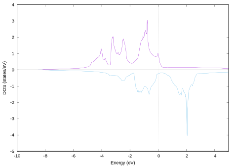
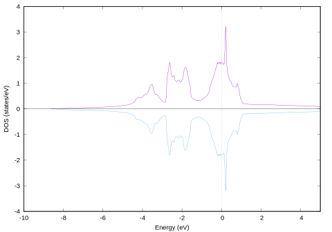
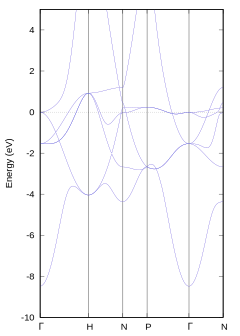

体心立方鉄
=

体心立方格子の鉄の計算です。
本サンプルの最大の特徴は、磁性、すなわち電子のスピン自由度を考慮していることです。
状態密度やバンド構造は、アップスピンとダウンスピンそれぞれについて計算されます。
また、SCF計算の後処理での状態密度計算を紹介します。

入力ファイルではBravais格子を与えますが、電子状態計算は体心立方の基本格子について行います。

# SCF計算（scf）

Si2のSCF計算と対比して説明します。

鉄（体心立方）は強磁性材料であり、計算に際してスピンを考慮するのが適切です。
スピンを考慮する指定は、

```
magnetic_state = ferro
```

です。

`ferro`というキーワードから強磁性を指定している印象を持ちますが、**スピンを考慮した計算**と解釈いただく方が適切です。
半導体中の不純物など、強磁性ではないけれどもスピンを考慮することが重要な計算でも`ferro`を指定します。

さらに、初期スピン分極を与えることが好ましいです。
`zeta`としてこの例では0.275を与えています。

```
element_list{ #tag element  atomicnumber     zeta  dev
                         Fe            26    0.275  1.5 }
```

初期スピン分極の規定値はゼロです。

入力ファイルで与えている格子は、一辺が2.8Åの立方体のBravais格子です。

```
unit_cell{
        #units angstrom
        a = 2.845, b = 2.845, c = 2.845
        alpha = 90, beta = 90, gamma = 90
}
```

体心格子にも基本格子があり、その体積はBravais格子の半分です。
次の指定で、基本格子で計算することを指示します。

```
symmetry{
        crystal_structure = bcc
}
```

この指定も汎用性が低いので、以下のように書き換えても良いです。

```
symmetry {
    method = automatic
    tspace { lattice_system = basecentered }
    sw_inversion = on
}
```

鉄の場合は、基本格子の中の原子は一つだけです。

```
atoms{
    #tag  rx       ry         rz      element
        0.000     0.000     0.000          Fe
}
```

金属（バンドギャップが無い系）はk点分割数を多めにした方が収束しやすい傾向があります。
また、smearingには四面体法`tetrahedral`が指定されています。
この指定があると、k点分割手法の規定値が`mesh`に変更されます。

```
ksampling{
!       method = mesh
        mesh{ nx = 10, ny = 10, nz = 10 }
}
smearing{
        method = tetrahedral
}
```

このSCF計算の後処理で四面体法による状態密度をするように、入力ファイルを変更します。

```
Postprocessing{
        dos{
                sw_dos = on
                method = tetrahedral
                  ...
        }
          ...
}
```

`sw_dos = on`に書き換えました。

対称性（空間群）を利用した結果、計算対象のk点が削減されます。
（次のコマンドは、一度phase計算を実行し、output000が出力された後にお試しください。）

```sh
$ grep kv3 output000
 !kp kv3 =      182 nspin =     2
$
```

k点の数は182ですが、この値はアップスピンとダウンスピンを別々に数えた結果です。
k点並列で分割可能なのは、この半分の91です。
最近のPHASE/0は、総並列数がk点数の約数で割り切れる場合には、指定せずともk点並列で計算実行してくれるのですが、本例では並列数が7もしくは13の倍数でない限り、無指定ではk点並列が利用されません（7 x 13 = 91）。
並列分割を指定して、（主に）k点並列で実行することをお勧めします。

```sh
$ mpiexec -np 4 ../../../../bin/phase ne=1 nk=4
```

ここではスピン分極が収束する様子を確認します。
先に入力ファイルで指定した0.275は、アップスピン電子とダウンスピン電子の数の差を、価電子数で割った値です。
アップ・ダウンスピンの電子数は、SCF計算過程で更新されます。

```sh
$ grep NEW output000
 !*--- input-file style = NEW
	       1  pulay  0.40   0.40   on    3     15    RENEW
 !NEW total charge (UP, DOWN, SUM) =     5.07088896 (+)    2.92911104 (=)    8.00000000
 !NEW total charge (UP, DOWN, SUM) =     5.06855840 (+)    2.93144160 (=)    8.00000000
 !NEW total charge (UP, DOWN, SUM) =     5.06912016 (+)    2.93087984 (=)    8.00000000
 !NEW total charge (UP, DOWN, SUM) =     5.07473246 (+)    2.92526754 (=)    8.00000000
 !NEW total charge (UP, DOWN, SUM) =     5.09450651 (+)    2.90549349 (=)    8.00000000
 !NEW total charge (UP, DOWN, SUM) =     5.10584545 (+)    2.89415455 (=)    8.00000000
 !NEW total charge (UP, DOWN, SUM) =     5.12572863 (+)    2.87427137 (=)    8.00000000
 !NEW total charge (UP, DOWN, SUM) =     5.12847740 (+)    2.87152260 (=)    8.00000000
 !NEW total charge (UP, DOWN, SUM) =     5.12835922 (+)    2.87164078 (=)    8.00000000
 !NEW total charge (UP, DOWN, SUM) =     5.12855988 (+)    2.87144012 (=)    8.00000000
 !NEW total charge (UP, DOWN, SUM) =     5.12858706 (+)    2.87141294 (=)    8.00000000
 !NEW total charge (UP, DOWN, SUM) =     5.12859479 (+)    2.87140521 (=)    8.00000000
 !NEW total charge (UP, DOWN, SUM) =     5.12859648 (+)    2.87140352 (=)    8.00000000
 !NEW total charge (UP, DOWN, SUM) =     5.12859696 (+)    2.87140304 (=)    8.00000000
$
```

繰り返し計算過程でのアップスピンとダウンスピンの数が出力されています。
それぞれ更新されて、収束した時点では、アップスピンが5.13個（多数派）に対してダウンスピンが2.87個（少数派）と求まりました。

状態密度は、アップスピンとダウンスピンに対してそれぞれ計算されます。

```sh
$ ../../../../bin/dos.pl dos.data -erange=-10,5 -with_fermi -color
```




さてここで、初期スピン分極の重要性を理解するために、この値をゼロにして再計算してみます。

アップとダウンの電子数は4個ずつで等しく、スピン分極は初期値から有意に変化することなしに、電子状態が収束しました。

```sh
% grep NEW output001
 !*--- input-file style = NEW
	       1  pulay  0.40   0.40   on    3     15    RENEW
 !NEW total charge (UP, DOWN, SUM) =     4.00600904 (+)    3.99399096 (=)    8.00000000
 !NEW total charge (UP, DOWN, SUM) =     4.00601936 (+)    3.99398064 (=)    8.00000000
 !NEW total charge (UP, DOWN, SUM) =     4.00683961 (+)    3.99316039 (=)    8.00000000
 !NEW total charge (UP, DOWN, SUM) =     4.00867987 (+)    3.99132013 (=)    8.00000000
 !NEW total charge (UP, DOWN, SUM) =     4.01206260 (+)    3.98793767 (=)    8.00000027
 !NEW total charge (UP, DOWN, SUM) =     4.01914617 (+)    3.98085406 (=)    8.00000023
 !NEW total charge (UP, DOWN, SUM) =     3.99953179 (+)    4.00046866 (=)    8.00000044
 !NEW total charge (UP, DOWN, SUM) =     4.00087913 (+)    3.99912103 (=)    8.00000016
 !NEW total charge (UP, DOWN, SUM) =     4.00003972 (+)    3.99996031 (=)    8.00000003
 !NEW total charge (UP, DOWN, SUM) =     4.00002395 (+)    3.99997605 (=)    8.00000000
 !NEW total charge (UP, DOWN, SUM) =     3.99999342 (+)    4.00000658 (=)    8.00000000
 !NEW total charge (UP, DOWN, SUM) =     3.99999862 (+)    4.00000138 (=)    8.00000000
%
```

状態密度を見ても、アップスピンとダウンスピンはほぼ対称です。



ここまで一つの系に対して、二つの電子状態が得られました。
どちらが正しい（より尤もらしい）のかは、全エネルギーを基準に判断します。
自然は安定な状態を好みますので、全エネルギーが低い状態が実現していると考えます。
全エネルギー二回分の計算結果が`nfefn.data`ファイルに出力されています。

```
  iter_ion, iter_total, etotal, forcmx
     1      14      -21.9923339387        0.0000000000
  iter_ion, iter_total, etotal, forcmx
     1      12      -21.9711351550        0.0000000000
```

先に計算した、スピン分極した状態の方が、エネルギーが低いことがわかります。
すなわち、鉄が磁石になることが、第一原理電子状態計算で再現できました。

# 状態密度（dos）

SCF計算で求めた状態密度とほぼ同じ結果が得られます。

バンド数`num_bands`は10が指定されていますが、収束判定に関与しない余分なバンド`num_extra_bands`10個を加えた結果、計20バンドで計算されます。

電荷密度固定計算の収束判定は、非占有準位まで含めたエネルギー固有値の変化量が十分に小さくなることです。
この際、余分な`num_extra_bands`個のバンドは収束判定に加わりません。
一方、SCF計算の収束判定は全エネルギーの変化量ですので、占有順位のみが関与します。

ごく稀に、SCF計算の後処理として求めた状態密度やバンド構造がおかしな振る舞いを示すことがあります。
その場合は、非占有準位のエネルギー固有値が収束していないことを疑ってみてください。

# バンド構造図（band）

バンド構造図の作成には、電荷密度固定計算が必須です。
その手順は、スピンを考慮しない計算と本質的な違いはありません。

初期スピン分極をゼロにしたSCF計算を実行した場合は、初期スピン分極を0.275に戻して、再度SCF計算を実行してください。
電荷密度固定計算では、SCF計算結果の電荷密度を参照します。
SCF計算が正しく実行されていることが、バンド構造図を正しく求める前提となります。

体心立方格子のバンド構造図用k点生成テンプレートは`../../../tools/bandkpt_bcc_ghnpgn.in`です。
`band_kpoint.pl`を使ってk点ファイル`kpoint.data`を生成します。

```sh
$ ../../../../bin/band_kpoint.pl ../../../tools/bandkpt_bcc_ghnpgn.in
```

電荷密度固定計算を実行します。

```sh
$ mpiexec -np 2 ../../../../bin/ekcal ne=2 nk=1
```

バンド構造図を作成して、描画します。

```sh
$ ../../../../bin/band.pl nfenergy.data ../../../tools/bandkpt_bcc_ghnpgn.in -erange=-10,5 -with_fermi -color
```

