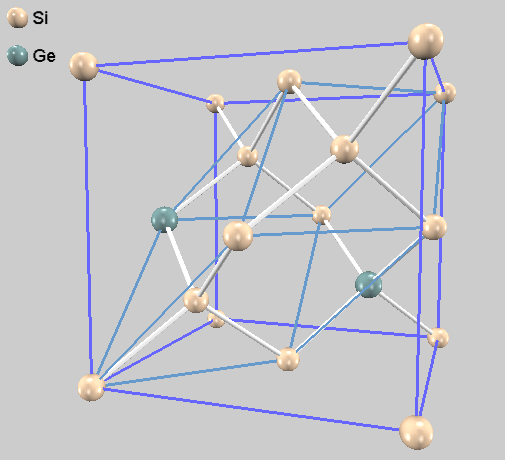

# バンドアンフォールディング

## 概要

バンド構造図は原則として基本格子に対して作成します。
教科書や論文では、ほぼ間違いなくそのようになっています。
実空間の繰り返し単位を大きくすると**逆格子は折りたたまれ**てしまい、バンド構造図に含まれる情報量が減少します。
大きな逆格子についてのバンド構造の方が情報を豊富に含みますので、実空間での最小の繰り返し単位である基本格子に対するバンド構造の情報量が最大です。

第一原理計算の多くの手法では、不純物や欠陥を扱う際にスーパーセルを用います。
通常の計算手続きでそのバンド構造を計算すると、折りたたまれてしまいます。

実験との比較においては、情報量が多い、折りたたまれていないバンド構造図が好まれます。
これを提供するために、折りたたまれたバンド構造を**解きほぐす操作**が、アンフォールディングです。

本サンプルでは、シリコン単結晶にゲルマニウムをドープした系のバンド構造図を求めます。



## SCF計算 (scf)

ダイヤモンド構造のSi単結晶Bravais格子8原子から、2原子がGeに置換されています。
格子は立方体です。
一様なGeドープを想定すると、平均的に立方体であると考えるのは妥当です。
格子内部の原子配置は、ほぼダイヤモンド構造を保ちますが、わずかに原子は変位します。
用意されているサンプルには、最適化済みの原子位置が設定されています。

ところで、ノルム保存型擬ポテンシャルのみを使用した計算であるにもかかわらず、電荷密度のカットオフエネルギー（225 Rydberg）は、波動関数のそれ（25 Rydberg）の9倍に設定されています。
これは過剰な設定ですので、電荷密度のカットオフエネルギーを100 Rydbergに変更してから、SCF計算を実行します。

```C
    cutoff_cd = 100.0 Rydberg
```

```sh
mpiexec -np 2 ../../../../../bin/phase ne=1 nk=2
```

## バンドアンフォールディング (band)

SCF計算で得た電荷密度を使った電荷密度固定計算により、アンフォールドされたバンド構造を求めます。

入力ファイルでは実格子に加えて、バンド構造を作成する（逆格子に相当する実）格子を`reference_cell`で指定します。

```C
    reference_cell{
          a_vector =  0.0000000000 5.2378398245 5.2378398245
          b_vector =  5.2378398245 0.0000000000 5.2378398245
          c_vector =  5.2378398245 5.2378398245 0.0000000000
    }
```

アンフォールドされたバンドは均一な曲線ではなく、各点からの寄与が**重み**を持ちます。
入力ファイルの以下の指定で、その重みの計算を指示します。

```C
postprocessing{
    band_unfolding{
        sw_band_unfolding = on
    }
}
```

k点座標ファイルは、`reference_cell`に対して作成します。
本サンプルでは、面心立方格子の基本格子が対象です。

```sh
../../../../../bin/band_kpoint.pl ../../../../tools/bandkpt_fcc_xglux.in
```

SCF計算でカットオフエネルギーを変更した場合は、電荷密度固定計算でも同じようにカットオフを変更することを忘れないでください。

```C
    cutoff_cd = 100.0 Rydberg
```

電荷密度固定計算を実行します。

```sh
mpiexec -np 2 ../../../../../bin/ekcal ne=2 nk=1
```

通常のバンド計算の出力ファイルに加えて、`nfband_spectr_wght.data`が出力されることを確認してください。
ここに、先に述べた**重み**が書き出されています。
アンフォールドされたバンド構造図を作成するスクリプトは`band_unfold.pl`です。
`nfenergy.data`と`bandkpt.in`と共に、`nfband_spectr_wght.data`を指定して利用します。

```sh
../../../../../bin/band_unfold.pl nfenergy.data ../../../../tools/bandkpt_fcc_xglux.in nfband_spectr_wght.data -erange=-13,8 -color -with_fermi
```

`unfolded_band.eps`がバンド構造図です。


