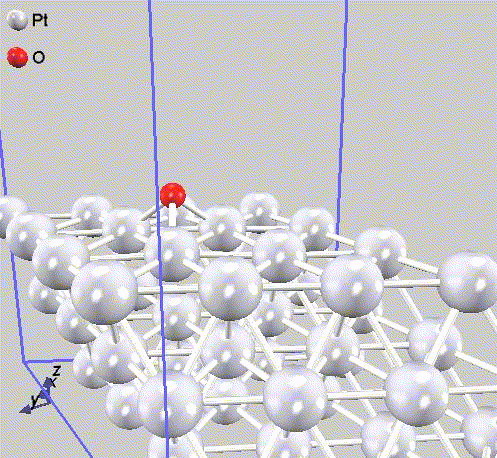
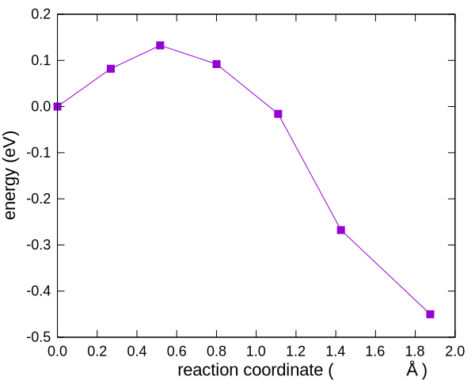
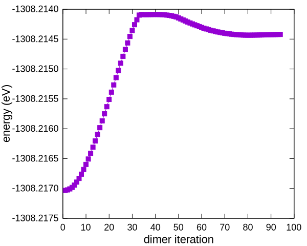

# NEB法とDimer法



二つの準安定状態間の反応障壁（遷移状態のエネルギー）を求める計算です。
化学反応（素過程）の前後の原子配置を与えて、その間の障壁エネルギーを求めます。

## 対象とする系：白金(111)での酸素原子拡散

Pt(111)面上でのO原子吸着と拡散を扱います。

Pt(111)最表面の原子配列は、三角形を形成しています。
三角形中心（重心）の原子吸着位置をhollowサイトと呼びます。
hollowサイトは、二層目のPt原子によって二種類に分類されます。

- fcc：二層目にPt原子が存在します。
- hcp：二層目にPt原子が存在しません。

各サイトへのO原子の吸着エネルギーは、構造緩和計算で求めます。

`samples/dynamics/neb/Pt111/fcc`
`samples/dynamics/neb/Pt111/hcp`

O原子は、hcp hollowサイトに吸着する方が、fcc hollowサイトに吸着するよりも安定であることがエネルギー比較からわかります。

## NEB法

fcc hollowサイトに吸着したO原子（始状態）が、hcp followサイト（終状態）に移動する過程を探索します。

`samples/dynamics/neb/Pt111/fcc_hcp_cg`

先に述べた通り終状態の方が安定ですが、始状態から出発する構造緩和計算では、終状態に到達できません。
終状態に向かう過程でエネルギーが高い原子配置（活性化障壁、反応バリア、などとも呼びます）を経由する必要があり、構造緩和計算はこれを超えないからです。

現実世界の有限温度環境下では、始状態から終状態へ障壁を超えて原子が拡散することがあります。
この拡散の生じやすさを評価する指標が、障壁エネルギーです。

NEB法は、反応過程に複数の「レプリカ」を挿入して、隣接レプリカ間の相互作用を考慮した構造緩和により、活性化エネルギーが最小となる反応経路を見つける計算手法です。
計算設定の詳細はマニュアルで説明されていますので参照してください。

ここでは実行結果の確認に重きを置いて説明します。

計算実行が終了したら、計算が完了していることを確認します。
PHASE/0の計算は、全ての収束条件を満たした時に終了するのはもちろんのこと、予定された計算時間を超過した場合などにも計算実行を終了（中断）します。
計算が停止したのち、収束条件を満たしていることを確認します。

`output_neb_p000`ファイルの末尾

```C
 convergence check...          27
  force (neb):   7.038051877109841E-004  1.000000000000000E-003 T
 write down data replica...
```

2行目（ファイル末尾からも2行目）の末尾が`T`であることが、収束した計算であることを示します。
未収束の場合は`F`です。
収束していない場合はその理由を確認して継続計算してください。
（継続計算の際、`condition = automatic`が利用できないことにご注意ください；`condition = continuation`と設定してください。）

レプリカごとの`output`ファイル（例：`output000_r003`）の末尾（エンドマーク）は、（計算中のレプリカを除き）計算全体の収束状況と無関係に`CHG CONV`となっており、有益な情報ではありません。

`nfdynm.data`には、収束した（最後に計算した）反応経路の原子配置が出力されています。
これを可視化することにより、当該反応における原子の移動を確認します。
冒頭の動画は、これを可視化したものです。

なお、最適化過程を含む全NEBステップの原子配置の履歴は`nfnebdynm.data`に出力されています。

`nfefn.data`には、最終NEBステップでの、各レプリカのエネルギー値が、反応座標値とともに出力されています。
反応座標に沿ったエネルギー変化を読み取ります。



左が始状態（fcc hollowサイト）、右が終状態（hcp hollowサイト）です。
障壁エネルギーは、約0.13 eV、遷移状態はレプリカ3です。

計算途中を含む全NEBステップにおける各レプリカエネルギーの履歴は`nfnebenf.data`に出力されます。

## Dimer法

NEB法では、始状態と終状態を与えて、反応経路と障壁エネルギーを求めました。
障壁エネルギー（遷移状態のエネルギー）は、実用上ほとんどの場合に求めたい物理量ですが、遷移状態以外の反応経路全体には興味がない場合が少なくありません。
反応経路全体を求めるNEB法は、必ずしも効率的な手法ではありません。

Dimer法は、遷移状態に注目する計算手法です。
適切に利用すると、効率的に遷移状態を探索できる場合があります。

まずは、サンプルをそのまま実行します。
Dimer法は、継続計算に対応していません。
本例題は実行に時間を要しますので、多くの計算機資源が利用できる時にお試しください。

`samples/dynamics/dimer/Pt111`

入力ファイルで初期原子配置を与えた2つのレプリカで「ダイマー」を構成し、両レプリカを更新しながら遷移状態を探索します。
この例では、初期レプリカとして、NEB法で用いた始状態と終状態が与えられています。
繰り返し計算の過程は、ダイマー中心のエネルギーが`nfefn.data`に出力され、その最後の数値が遷移状態のエネルギーです。

```C
   ...   ...                          ...
   79    -1308.214123976946439        0.0006169899
   80    -1308.214125497485611        0.0005570649
   81    -1308.214126955229858        0.0004961436
```

NEB計算結果の遷移状態のエネルギーとほぼ同じであること、を確認してください。

ところで本例題は、NEB計算よりも計算時間を要しました。
反応素過程の始状態と終状態を入力ファイルで与えるのであれば、多くの場合にNEB計算の方が効率が良いと思います。
Dimer法は、遷移状態に関する知見がある場合に、その近傍から計算を開始できることに特徴があります。

知見の例として、NEB計算の結果を参照します。
レプリカ3が遷移状態でしたので、その前後、[レプリカ2と4の原子配置を与えた入力ファイル](./nfinp24.data)を用意しました。
計算結果は以下のようになりました。

```C
   ...   ...                          ...
   37    -1308.214193613565385        0.0005500070
   38    -1308.214195319925921        0.0005202682
   39    -1308.214197065399503        0.0004901165
```

計算時間は大幅に短縮されました。
遷移状態のエネルギーは、元の実行例と比較して、より小さい数値が得られましたが、その差は2 meVであり、有意な差ではありません。
同じ状態に到達したと解釈します。

もう一例試します。
遷移状態を間に挟んだ、レプリカ2と4を与えて正しい結果を得ることを確認しましたが、
入力で与える2つのレプリカは、遷移状態の両側である必要はありません。
遷移状態から見て終状態寄りの2つの[レプリカ4と5を初期値として与えた計算](./nfinp45.data)も実行します。

```C
   ...   ...                          ...
   92    -1308.214423630011197        0.0005435071
   93    -1308.214422509929136        0.0005159086
   94    -1308.214421333020255        0.0004870281
```

この場合も、同じ状態に収束しました。

PHASE/0の原子配置を探索する計算では、計算が進むに従ってエネルギーが減少することがほとんどです。
Dimer法の最後の例では、計算前半で「エネルギーが上昇」しますが、入力ファイル作成の考え方ならびに計算結果の確認から、これが正しい動作であることがわかります。



最後に、マニュアルに倣って、各計算で求めた遷移状態のO原子位置を比較します。
ほぼ同じ構造であることが確認できます。

| 酸素原子座標<br>(bohr) | NEB法 | Dimer法<br>fcc-hcp | Dimer法<br>レプリカ2-4 | Dimer法<br>レプリカ4-5 |
| :-------------: | :-------------: | :-------------: | :-------------: | :-------------: |
| x | 20.248 | 20.242 | 20.206 | 20.319 |
| y | 11.690 | 11.687 | 11.666 | 11.731 |
| z | 12.647 | 12.635 | 12.644 | 12.633 |
