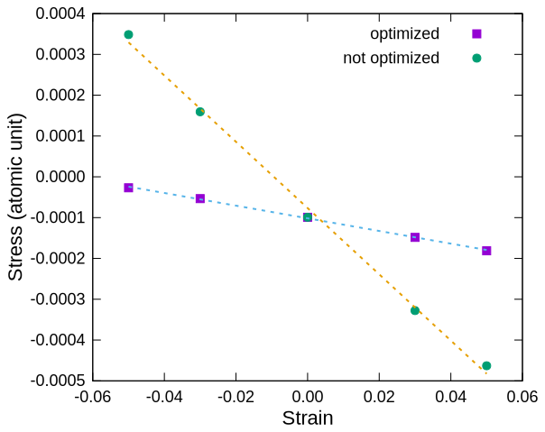

# 弾性定数解析

## 概要

SiO<sub>2</sub> (Cristobalite)を題材に、弾性定数の計算手順を紹介します。
PHASE/0には、格子に作用するストレス（応力）テンソルを解析する機能が備わっています。
格子を変形させた際のストレス変化から、弾性定数を求めます。

次節では準備として、格子の最適化を含めて、安定な原子配置を求めます。
その次の節で、格子を変形させて、弾性定数を求めます。

なお、擬ポテンシャルには

```fortran
O_ggapbe_paw_us_02.pp
Si_ggapbe_paw_nc_01.pp
```

を使いました。

## 準備：構造緩和計算（格子と内部原子座標の最適化）

α、β両Cristbaliteを対象とします。
ストレステンソル補正を考慮した、自動最適化機能を利用します。

### α-Cristobalite

格子定数を最適化する際には、PHASE/0入力ファイルに以下の記述を追加します。

```C
structure_evolution {
        stress {
                sw_stress_correction = on
                delta_ecut = 1.0 Rydberg
        }
        lattice { sw_optimize_lattice = on }
}
```

ストレス補正機能では、全エネルギーのカットオフエネルギー依存性からストレス補正量を求めます。
依存性を調べる際に（PHASE/0は内部で自動的に）カットオフエネルギーを変化させるので、その変化幅`delta_ecut`を`1 Rydberg`に設定しました。

最適化済みの構造を書き込んだPHASE/0入力ファイルは[こちら](./inputs/nfinpAlphaOpt.data)です。
格子定数を含む最適化計算が設定されていますが、最適化済みの原子配置が記入されているため、原子配置を更新することなく、計算が終了します。

```C
  iter_unitcell, iter_ion, iter_total, etotal, forcmx, stressmx
     1    1      30     -144.5962608791        0.0000816450        0.0000008777
```

### β-Cristobalite

β-Cristobaliteは立方晶、かつ、格子内部の原子配置の対称性が高く、各原子に力は作用しません。

最近のPHASE/0では、格子定数の指定を簡略化できます。
立方体を指定する場合は、a軸の長さをのみを指定すれば十分です。

```C
structure {
        unit_cell_type = Bravais
        unit_cell {
                a = 14.142324098
        }
        ...
        ...
}
```

最適化済みの構造を書き込んだPHASE/0入力ファイルは[こちら](./inputs/nfinpBetaOpt.data)です（格子定数を含む最適化計算の設定あり） 。
面心基本格子を用いた、6原子の計算です。

```C
  iter_unitcell, iter_ion, iter_total, etotal, forcmx, stressmx
     1    1      31      -72.2953618551        0.0000000000        0.0000009932
```

なお、立方晶は格子を定めるパラメータが一つだけなので、全エネルギーの格子定数（体積）依存性をマーナハンの固体状態方程式にフィティングして安定な格子定数を求めることが難しくありません。
そしてこの手順の方が、計算精度が高い（よりエネルギーが低い構造に到達しやすい）傾向があります。

## 弾性定数：c33

弾性定数の評価に際しては、格子歪の有無によるストレスの相対的な変化量が重要です。
先の構造緩和で使用したストレス補正機能は、ストレステンソルの対角各要素を一定量シフトさせるだけなので、以下手順の弾性定数評価においては効果がありません。
ここからはストレス補正機能を利用せずに、安定な格子定数におけるストレス値を基準にして、そこからの変化量に注目します。

格子歪を与えない、安定な格子におけるストレステンソルを計算します。
PHASE/0入力ファイルは[こちら](./inputs/nfinpAlpha00.data)です。
ストレス補正機能を利用していません。

計算の結果、ストレステンソルは次のように求まりました。

```C
  Total STRESS TENSOR
       -0.0000982729        0.0000000000        0.0000000000
        0.0000000000       -0.0000982729        0.0000000000
        0.0000000000        0.0000000000       -0.0000991680
```

ストレステンソルの(3,3)要素に注目します。
この値を基準にして、歪を与えた時にストレス値がどの程度変化するのか調べます。

例えば、c軸を5%長くする歪を与えるには、PHASE/0入力ファイルに以下のように記述します。

```C
structure {
    ...
    ...
        strain {
                sw_strained_cell = on
                e33 = 0.05
        }
}
```

もしくは、入力ファイルの格子定数を書き換えても効果は同じです。

```C
structure {
        unit_cell_type = bravais
        unit_cell {
        !       a = 9.6889702445, b = 9.6889702445, c = 13.5543097542
                a = 9.6889702445, b = 9.6889702445, c = 14.23202524191
                alpha = 90.0, beta = 90.0, gamma = 90.0
        ...
        ...
```

（どちらか一方のみ指定します；両方指定すると、約10%歪ませることに相当します。）
後者の設定を書き込んだPHASE/0入力ファイルは[こちら](./inputs/nfinpAlpha05.data)です。

格子の形が変わると、格子内部での安定な原子配置も変化します。
格子の変形それぞれに対して、原子位置を最適化してください。
格子の歪みとストレス値の関係を下図に示します（`optimized`）。



c軸方向に歪を与えた際の、ストレステンソル(3,3)要素の比例係数（の符号を変えたもの）が$c_{33}$です。
格子を歪ませない安定構造においてストレスの(3,3)成分は非零ですので、それを考慮してゼロでない切片を含む一次式$f(x)=a*x + b$でフィッティングして、直線の傾きを求めます。
傾きから求めた$c_{33}$は46 GPaでした。

なお、格子を歪ませた際の原子位置の最適化を省略（上図`not optimized`）すると、弾性定数を5倍以上大きく評価してしまいます。

## 弾性定数：c44

$c_{44}$の計算では、β型のCristobaliteを対象とします。
基本的な手順は$c_{33}$の計算と同じですが、以下の点が異なります。

- 電子状態計算に基本格子ベクトルを用います。
- 「ずり」変形を与えて、ストレステンソルの非対角要素の変化を調べます。

安定な格子では、ストレステンソルの非対角成分は、対称性の要請から厳密にゼロです。
ここでもストレス補正機能は利用しません。

歪を与えない構造（立方晶）では、原子に作用する力はなく、原子位置最適化の設定（`mobile`属性）は計算結果に影響を及ぼしませんでした。
格子を歪ませると原子に力が作用するようになりますので、原子位置が可動になっていることを確認してください。

さて、PHASE/0で格子を歪ませる設定を以下に示します。
入力ファイルは[こちら](./inputs/nfinpBeta05.data)です。

```C
structure {
    ...
    ...
        strain {
                sw_strained_cell = on
                e23 = 0.05
        }
}
```

本設定が格子ベクトルをどのように変形するのか、確認します。
計算の結果、`nfdynm.data`に、基本格子のベクトル表示が出力されます。

```C
#   a_vector =         0.0000000000        7.4247201514        7.0711620490
#   b_vector =         7.0711620490        0.3535581025        7.0711620490
#   c_vector =         7.0711620490        7.0711620490        0.0000000000
```

この基本格子をBravais格子に変換すると、以下のようになります。
`c_vector`の$y$成分に、格子定数の5%相当の変形が加わっています。

```C
structure {
        unit_cell_type = Bravais
        unit_cell {
                a_vector = 14.142324098   0.0           0.0
                b_vector = 0.0           14.142324098   0.0
                c_vector = 0.0            0.7071162049 14.142324098
        }
        ...
        ...
```

電子状態は基本格子に対して計算されますが、ストレステンソルの結果は、Bravais格子に変換して出力されています。

```C
  Total STRESS TENSOR
       -0.0000929065        0.0000000000        0.0000000000
        0.0000000000       -0.0000991547       -0.0001404418
        0.0000000000       -0.0001404418       -0.0000881451
```

この(3,2)成分の、e23に対する比例係数（の符号を変えたもの）が、弾性定数$c_{44}$です。
歪量を変えた複数の計算を実行すると、歪量とストレスの関係は、下図のようになりました。
原子位置の最適化を行った`optimized`が、弾性定数の計算にふさわしい結果です。


格子を歪ませない安定構造においてストレスの(3,2)成分はゼロですので、切片のない一次式$f(x)=a*x$でフィッティングします。
直線の傾きから求めた$c_{44}$は、83 GPaでした。

ここでも、格子を歪ませた際の原子位置の最適化を省略（上図`not optimized`）すると、弾性定数を大きく評価してしまいます（二倍弱）。
