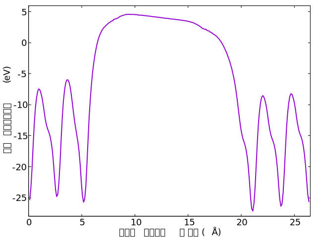
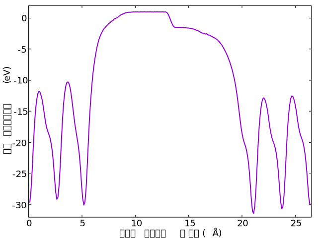
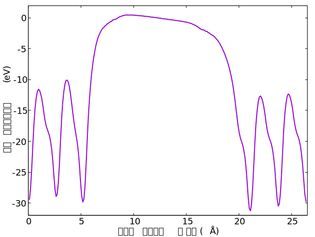
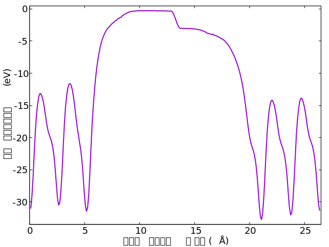
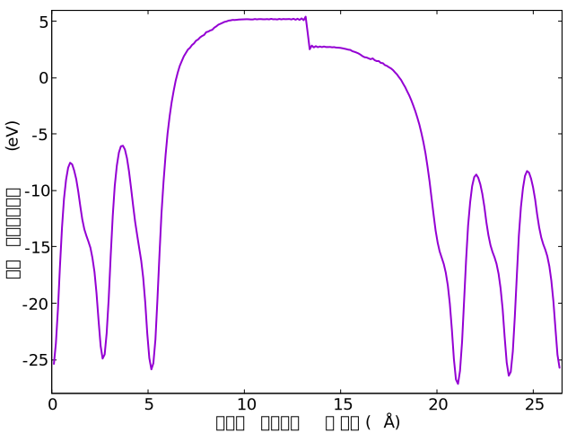
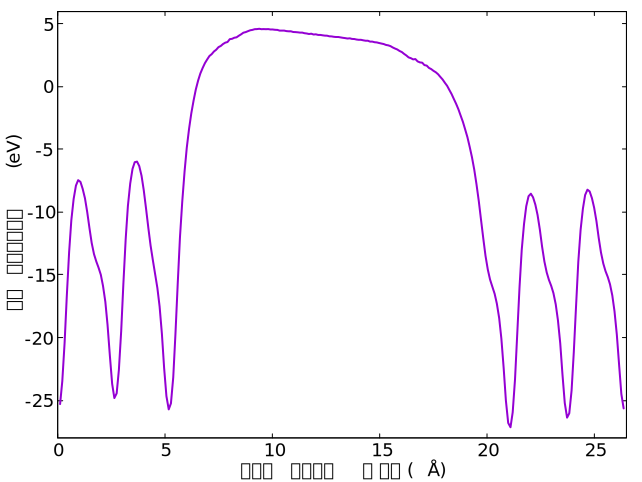

# ESM法とDipole補正

## 概要

PHASE/0は原則として、周期境界条件下で電子状態を求めます。
スラブ模型を利用して表面（二次元系）を扱う際にも、表面垂直方向に周期境界条件を課して、三次元の繰り返し構造で代用（近似）することが多いです。
ところで、表面は分極を生じることがあります。
分極を生じるスラブの法線方向に周期境界条件を課すと、真空層を介したスラブ間に、分極に起因する電場が生じてしまいます。
この電場は、本来**周期的でない**ものに周期境界条件を課した結果ですので、電子状態計算に望ましくない影響を及ぼします。

PHASE/0には、一次元方向の周期境界条件を無効化する機能が備わっています。

- ESM法
- Dipole補正

この機能を利用すると、分極した表面（スラブ）によって生じる電場を除去できます。
そして、積極的に電場を印加することもできます。
以下では、両機能を紹介します。

## 計算準備

分極を生じる表面（スラブ）として、GaN (0001)を用意しました。
最適化済みの構造を書き込んだPHASE/0入力ファイルは[こちら](./inputs/nfinp0.data)です。

局所ポテンシャルを下図に示します。
スラブに分極（電気双極子）が生じて、周期境界条件下ではそれを打ち消すための電場（局所ポテンシャルの勾配）が生じます。
横軸10から15Åは原子が存在しない真空層ですが、局所ポテンシャルは傾いており、電場の存在を示します。



なお本モデルは、計算機能を説明するための**分極を生じるスラブ**として作成しました。
GaN表面の物理現象を適切に模擬することまでは目指していません。

## ESM法

ESM法を利用して、表面に垂直な方向の周期境界条件を無効化します。
設定を追加したPHASE/0入力ファイルは[こちら](./inputs/nfinpBARE.data)です。

局所ポテンシャルを下図に示します。
真空層の真ん中（横軸13Å付近）で、局所ポテンシャルが急激に（不連続的に）変化しています。
これがESM法で周期境界を無効化した結果です。
表面と裏面、それぞれ真空層側に（少し）離れたところで、局所ポテンシャルは平坦です。
表面側と裏面側の真空層の間には約2.6 Vの電位差（約2.6 eVのエネルギー差）がありますが、ESMがそれを吸収し、真空層では（ESM位置を除いて）電場（ポテンシャル勾配）を生じません。



### ESM法の有限電場計算

ESM法では、境界条件を選択して利用します。
先ほどの例では境界条件を指定しておらず、既定値`BARE`が用いられていました。
これは、ESMが真空であることに相当します。
電場を印加する場合は、境界条件`PE1`を選択する必要があります。
この条件は、ESMが金属であることに相当します。

```C
        esm {
                sw_esm = on
                bc = pe1
        }
```

局所ポテンシャルを示します。
ESM法を利用しない計算結果とほぼ同じです。



次に電場を印加しましょう。
スラブの分極を、電場を使って再現します。
格子の長さ26.33Åにわたって2.6 Vの電位差（2.6 eVのエネルギー差）を生じる電場を求めます。

$$ 2.6 (\mathrm{V}) \div 26.33 (\unicode{x212B}) \div 51.4 (\mathrm{V}/\mathrm{\unicode{x212B}/原子単位}) \sim 0.002 (\mathrm{原子単位}) $$

```C
        esm {
                sw_esm = on
                bc = pe1
                electric_field = -0.002
        }
```

`electric_field`に電場を原子単位（`Hartree/bohr`）で指定します。



## Dipole補正

ESM法では境界条件を選択できましたが、Dipole補正機能には同種の設定項目はありません。
Dipole位置の指定`vacuum`が独特ですので、常に`-0.5`を指定すると良いでしょう。
PHASE/0入力ファイルは[こちら](./inputs/nfinpDipole.data)です。

```C
control {
        sw_dipole_correction = on
}

accuracy {
          dipole_correction {
                direction = 3
                vacuum { rz = -0.5 }
                electric_field { ez = 0.0 }
        }
}
```

局所ポテンシャルを示します。
電場ゼロの計算では、ESM法の`BEAR`と同じように、表（裏）面から離れた位置で局所ポテンシャルが平坦になる解が得られます。



格子の中央（スラブ法線方向）には、スラブで生じた分極を打ち消すDipoleが配置されます。
Dipoleの大きさは、SCF計算の過程で最適化されます。

```C
$ grep '(NEW)' output000
Dipole: (NEW) dipole,field =    -0.00000596     0.00000000
Dipole: (NEW) dipole,field =    -0.00003883     0.00000000
Dipole: (NEW) dipole,field =    -0.00012903     0.00000000
...
Dipole: (NEW) dipole,field =    -0.00854320     0.00000000
Dipole: (NEW) dipole,field =    -0.00837376     0.00000000
Dipole: (NEW) dipole,field =    -0.00796395     0.00000000
...
Dipole: (NEW) dipole,field =    -0.00714504     0.00000000
Dipole: (NEW) dipole,field =    -0.00714503     0.00000000
Dipole: (NEW) dipole,field =    -0.00714507     0.00000000
...
Dipole: (NEW) dipole,field =    -0.00714507     0.00000000
Dipole: (NEW) dipole,field =    -0.00714507     0.00000000
```

スラブの分極を打ち消すような電場を与えてみましょう。
Dipole補正における、電場の単位の説明がマニュアルに見当たりませんが、おそらく`Rydberg/bohr`です。
ESM法で与えた電場の数値の二倍を指定します。

入力ファイルは[こちら](./inputs/nfinpDipoleEF.data)です。

```C
                electric_field { ez = -0.004 }
```

ESM法での電場印加と同じ符号の電場を与えていますが、

- ESM法では、真空中でスラブが有していた分極の復元に要する電場
- Dipole補正では、スラブが有する分極を打ち消す電場

を意図していますので、電場が**逆向き**であることにも注意してください。

局所ポテンシャルを見てみましょう。



Dipole位置での局所ポテンシャルの「とび」はなく、均一なポテンシャル勾配を生じています。
電場ゼロのDipole補正で生じた分極を、電場印加で（ほぼ）打ち消すことができました。
`output000`からも、打ち消していることが確認できます。

```C
Dipole: (NOW) dipole,field =    -0.01585266     0.01584944
Dipole: (OLD) dipole,field =    -0.01585266     0.01584944
Dipole: (NEW) dipole,field =    -0.01585266     0.01584944
Dipole: Edip(ion),Eext(ion)=        0.16140       -0.32274
Dipole: potential jump (dip and ext)=       -0.19921        0.19917
```

## まとめ

電場を印加することを、両電極間に電位差を与える、と解釈すれば、ESM法の電場の与え方が適しているでしょう。

ESM法には、今回利用していない`PE2`という境界条件があります。
