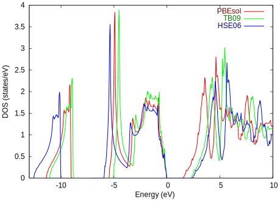

# メタGGA

## 概要

密度汎関数法に基づく第一原理電子状態計算は、多様な物質の性質を再現できる役立つ技術として広く認められています。
とはいえ電子状態の記述には改善の余地があり、計算手法の改良が続けられています。

メタGGAは、通常の電荷密度に加えて、**運動エネルギー密度**も利用して、電子状態の記述を改善する試みです。
このような考えに基づく汎関数が多数提案され、実用に供されています。

GGAで正確な記述が難しい物理量の筆頭格がバンドギャップであることに、異論は少ないでしょう。
メタGGAには特徴的な汎関数が用意されている中から、バンドギャップの改善を指向した汎関数を用いた計算例を紹介します。

## modified Becke-Jonsonポテンシャル (TB09)

modified Becke-Jonson (mBJ)ポテンシャルは`TB09`とも呼ばれ、メタGGAの一種です。
バンドギャップの改善に重きが置かれています。

一方`TB09`には欠点もあり、ストレスはおろか、原子に作用する力も、全エネルギーさえも求めることができません。
GGA等で原子配置を確定したのちの、電子状態の一点計算（状態密度やバンド構造図）のための手法、と捉えると良いでしょう。

PHASE/0では、ノルム保存型の擬ポテンシャルのみが利用可能です。

## 計算事例

PHASE/0付属サンプルで用意されている化合物半導体AlP, AlAsを試しましょう。

```sh
samples/meta_gga/AlP/tb09
samples/meta_gga/AlAs/tb09
```

各サンプルの`SCF`ディレクトリには（PBEsol汎関数を用いて）格子定数最適化済みの入力ファイルが用意されているようですので、その格子定数を使います。
いずれも閃亜鉛鉱型の原子配置ですので、格子内部での原子位置の最適化は不要です。
SCF計算に続く後処理で状態密度を計算する入力ファイルを用意しました。

- [AlP](./AlP/nfinp1.data) ([gzipped](./AlP/nfinp1.data.gz))
- [AlAs](./AlAs/nfinp1.data)([gzipped](./AlAs/nfinp1.data.gz))

付属サンプルで指定されているk点分割`12 x 12 x 12`は多い印象を持ちましたので、`8 x 8 x 8`まで減らしました。

### 並列計算実行：k点が多く、バンド数が少ない場合（二次元並列版）

対称性（空間群）を考慮したのち、計算対象となる独立なk点の数は`125`です。
計算実行時の並列の自動割り当て（`ne`, `nk`）を利用すると、並列数が`5`の倍数でなければk点並列が発動しません。
バンド数は`12`と多くありませんので、（特に並列数が多い場合は）並列分割数を明示的に指定することをお勧めします。

次のように二並列で実行すると、二つのプロセスが、それぞれ`63`, `62`個のk点を担当します。

```sh
mpiexec -np 2 ../../../../bin/phase ne=1 nk=2
```

同様に8並列では、8プロセスが、それぞれ`16`, `16`,`16`,`16`,`16`,`15`,`15`,`15`個のk点を担当します。

```sh
mpiexec -np 8 ../../../../bin/phase ne=1 nk=8
```

並列数が48まで多くなると、全てをk点並列に割り当てると計算負荷の不均衡が大きくなってしまいます（29プロセスが`3`個のk点、19プロセスが`2`k点を担当；計算時間は`3`個のk点を担当するプロセスに律速されます）。

```sh
mpiexec -np 48 ../../../../bin/phase ne=1 nk=48
```

このようなケースではバンド並列を併用した方が、計算時間が短くなる場合があります。

```sh
mpiexec -np 48 ../../../../bin/phase ne=3 nk=16
```

## 計算結果

バンドギャップ計算結果を下表にまとめました（単位：eV）。
GGA (PBEsol), `TB09`と併せて、ハイブリッド汎関数(HSE06)の計算結果も示します。
この例のように二原子でノルム保存擬ポテンシャルのみを使用する場合は、ハイブリッド汎関数の計算負荷もそれほど高くはありません。

| バンドギャップ | PBEsol | TB09 | HSE06 | 実験値 |
| :-------------: | :-------------: | :-------------: | :-------------: | :-------------: |
| AlP  | 1.47 | 2.29 | 2.35 | 2.45 |
| AlAs | 1.32 | 1.99 | 2.10 | 2.16 |

GGA (PBEsol)で求めたバンドギャップは、実験値の6割程度しかありません。
この程度のバンドギャップ過小評価は、GGAでは頻繁に生じます。
`TB09`ではずいぶん改善され、実験値との差は1割未満です。
最もよく実験値を再現するのは、HSE06でした。


### 計算時間

計算時間について、この例では、PBEsolを基準にして、`TB09`は9倍程度、HSE06は900倍以上でした。
そして計算規模が大きく（原子数が多く）なると、HSE06の計算負荷はPBEsolや`TB09`よりも急激に高くなります。

バンドギャップの実験値との一致はHSE06が良さそうですが、`TB09`はそれよりも（桁違いに）短い計算時間でバンドギャップ過小評価を（それなりに）改善します。
