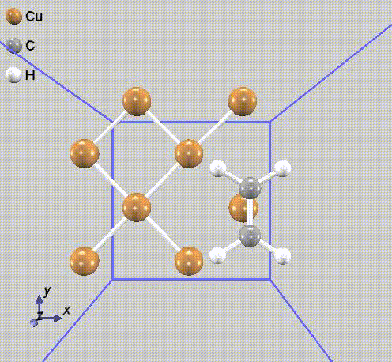

# 振動解析：Cu表面に吸着したエチレン分子

## 概要

結晶中の欠陥に起因する振動モードや固体表面に吸着した分子の振動モードなどは、空間的に局在している場合があります。
空間的に局在した振動のみに関心がある場合に、おそらく関係ないであろう遠方に位置する原子の変位まで含めて解析することは無駄に感じられます。
PHASE/0にはこれを回避する機能が備わっています。

本例では、Cu(001)に吸着したエチレン分子C<sub>2</sub>H<sub>4</sub>の振動を（効率よく）解析します。

## 振動解析

以前のバージョンでは、振動解析の際には`mobile`属性に関係なく、全ての原子を変位させて力の計算を行いました。

現在のバージョンでは、`mobile`属性を参照して、これが`on`の（`off`でない）原子のみを変位させて力の計算を行うように動作が変更されています。
振動解析では`mobile`属性の規定値は`on`ですので、明示的に`off`と指定した原子は、変位させられる対象から外れます。
（なお、過去のバージョンでは、`mobile`属性を`off`にしても、全ての原子の変位を考慮しました。）

本サンプルでは、振動解析（力計算）の対象となる原子の範囲を変えた複数の入力ファイルが用意されています。
力計算の対象となる原子数をカッコ内に示します。

- molonly: エチレン分子のみ（Cu基板原子は無し；6原子）
- ph1: エチレン分子＋Cu最表面（14原子）
- ph2: エチレン分子＋Cu表面から二層（22原子）
- phall: 全ての原子（38原子）

これに加えて、孤立したエチレン分子（6原子）の[入力ファイル](./files/nfinp.data)を用意しました。

なお、`mobile`属性が`off`の原子を含む振動解析では、対称性（空間群）を利用しないでください。

## 計算実行

`ph1`の実行例を以下に示します。
その他の例題も同じように実行できますので、読み替えてお試しください。

振動解析では各原子を6方向に変位させて力を計算しますので、`ph1`では$14 \times 6 = 84$通りの力を計算します。
振動解析の計算では、力を計算しない原子の変位分を含めて`iter_ionic`を数えます。
`iter_ionic`を計算進捗の指標にする際にはご注意ください。
この例では、`mobile`属性`off`の原子（24個）は、 入力ファイルの前に固まっています。
これらの原子を変位させた計算はしませんが`iter_ionic`には含みますので、`iter_ionic`が144まで実質的な計算は行われません。
計算開始後まもなく`iter_ionic`が145から、電子状態を計算します。
84通りの力計算を実施し、`iter_ionic`が228の計算を終えると、力の計算が終了します。
後処理として動力学行列を対角化して、`mode.data`に振動モードを出力します。

同ファイルはテキスト形式です。

```C
 n=    42 A   IR&R
     hbarW=  0.13847589E-01 Ha =  0.37681210E+00 eV; nu=  0.30391949E+04 cm^-1
```

`mobile`属性を`on`にした原子数の3倍の振動モードがあり、低い方から順に並んでいます。
$n$は振動モードの番号です。
振動数が異なる単位で出力されています。
最後の$3039 \text{cm}^{-1}$が馴染みのある単位ではないでしょうか。

## 振動モード可視化

`mobile`属性`off`の原子を含む振動解析では、`mode.data`の書式が異なるため、そのままでは`freq.pl`や`animate.pl`を利用することができません。
`mode.data`を編集して、振動モードを可視化する手順を説明します。

`mode.data`の書式は、以下のようになっています。

最初に、格子ベクトルが記載されています。

```C
 --- primitive lattice vectors ---
  13.6627189232   0.0000000000   0.0000000000
   0.0000000000  13.6627189232   0.0000000000
   0.0000000000   0.0000000000  37.7945198430
```

次に、すべての原子の平衡位置と質量が書かれています。
`mobile`属性`off`の原子を含む、すべての原子が記載されています。

```C
 --- Equilibrium position and mass of each atom---
 Natom=   38
     1   0.0000000000   0.0000000000   0.0000000000   115836.56299 Cu    0
     2   3.4156797310   3.4156797310   0.0000000000   115836.56299 Cu    0
     3   0.0000000000   6.8313594620   0.0000000000   115836.56299 Cu    0
     4   3.4156797310  10.2470391920   0.0000000000   115836.56299 Cu    0
     5   6.8313594620   0.0000000000   0.0000000000   115836.56299 Cu    0
     6  10.2470391920   3.4156797310   0.0000000000   115836.56299 Cu    0
     7   6.8313594620   6.8313594620   0.0000000000   115836.56299 Cu    0
     8  10.2470391920  10.2470391920   0.0000000000   115836.56299 Cu    0
     9  -0.0105539690   3.4250527580   3.4304899660   115836.56299 Cu    0
    10   3.4154809680  -0.0000002120   3.4211563700   115836.56299 Cu    0
    11  -0.0105785080  10.2376469440   3.4304828490   115836.56299 Cu    0
    12   3.4141717960   6.8313588940   3.4381838190   115836.56299 Cu    0
    13   6.8407517020   3.4251595990   3.4290711710   115836.56299 Cu    0
    14  10.2474426530  -0.0000327840   3.4419435460   115836.56299 Cu    0
    15   6.8407549980  10.2375454470   3.4291245390   115836.56299 Cu    0
    16  10.2461766780   6.8313499530   3.4215820540   115836.56299 Cu    0
    17   6.8461934850   0.0000605030   6.9154060230   115836.56299 Cu    0
    18  13.6489730830  13.6626477910   6.9159351950   115836.56299 Cu    0
    19   3.4155663480   3.4250299370   6.9399004470   115836.56299 Cu    0
    20   3.4154622580  10.2376870790   6.9399206940   115836.56299 Cu    0
    21   6.8775408330   6.8313423750   6.9977723670   115836.56299 Cu    0
    22  13.6107828800   6.8312944070   7.0030400540   115836.56299 Cu    0
    23  10.2463033660   3.4789378640   7.0201046930   115836.56299 Cu    0
    24  10.2463276750  10.1836346690   7.0201345090   115836.56299 Cu    0
    25  10.2450759720  13.6625956530  10.3309288780   115836.56299 Cu    0
    26   3.4097579540   6.8313803180  10.3433521370   115836.56299 Cu    0
    27   6.7887501710  10.2917847410  10.3561715780   115836.56299 Cu    0
    28   6.7889503030   3.3711052700  10.3564630740   115836.56299 Cu    0
    29   0.0439706960   3.3622539810  10.3580183210   115836.56299 Cu    0
    30   0.0436240550  10.3002323260  10.3583451750   115836.56299 Cu    0
    31   3.4218837890  13.6626701180  10.3674806560   115836.56299 Cu    0
    32  10.2533047130   6.8314060450  10.8313214600   115836.56299 Cu    0
    33  10.1983246560   5.5243260570  14.8621270400    21894.57964 C     0
    34  10.2063656220   8.1354406310  14.8629589710    21894.57964 C     0
    35   8.4303308550   4.4573304150  15.0571816600     1837.35098 H     0
    36   8.4451480870   9.2127582140  15.0580893850     1837.35098 H     0
    37  11.9545709460   4.4455517140  15.0893256280     1837.35098 H     0
    38  11.9690221000   9.2028380540  15.0909105020     1837.35098 H     0
```

その後、振動モードの情報が、振動モードの数（`Nnode= 42`）個分書かれています。
`mobile`属性`on`の原子のみが記載されています。

```C
 --- Vibrational modes ---
 Nmode=   42 Natom=   38
 n=     1 A   IR&R
     hbarW= -0.37855690E-03 Ha = -0.10301058E-01 eV; nu= -0.83083645E+02 cm^-1
    25  -0.0011706038  0.0002149406 -0.0014071297
    26   0.0011461050  0.0036660274  0.0028293774
    27  -0.0379587344  0.0252163630 -0.0696961890
    28   0.0359692016  0.0267541716  0.0730731848
    29   0.0387192986 -0.0233624399 -0.0703327706
    30  -0.0381665091 -0.0232789406  0.0692681904
    31   0.0001616034 -0.0002147884  0.0012784542
    32  -0.0002339877  0.0024072484 -0.0004012463
    33  -0.4938269553  0.0044317754 -0.0035853292
    34   0.5208998813  0.0014425681  0.0036178943
    35  -0.2649119000  0.2043777304  0.0042063269
    36   0.2752158009  0.2042031435 -0.0021038521
    37  -0.2657775284 -0.2002981220 -0.0086213159
    38   0.2736513955 -0.2036439322  0.0066450556
 n=     2 A   IR&R
     hbarW= -0.25202968E-03 Ha = -0.68580770E-02 eV; nu= -0.55314127E+02 cm^-1
    25   0.0021190061  0.3674104083 -0.0026993502
    26   0.0028026639  0.3501429443 -0.0022393639
    27   0.3544554589  0.0110071726 -0.0123770022
    28  -0.3523210970  0.0071833211  0.0194134031
    ...
    （以下省略）
```

`mobile`属性`off`の原子を含む振動解析では、平衡位置には`mobile`属性`off`の原子を含む、すべての原子が記載されていますが、振動モードは、`mobile`属性`on`の原子のみが記載されています。

「平衡位置」と「振動モード」の原子が一致しない場合に、後処理スクリプトが正しく動作しません。
`mobile`属性`off`の原子を平衡位置の情報から削除します。

```C
 --- Equilibrium position and mass of each atom---
 Natom=   14
    25  10.2450759720  13.6625956530  10.3309288780   115836.56299 Cu    0
    26   3.4097579540   6.8313803180  10.3433521370   115836.56299 Cu    0
    27   6.7887501710  10.2917847410  10.3561715780   115836.56299 Cu    0
    28   6.7889503030   3.3711052700  10.3564630740   115836.56299 Cu    0
    29   0.0439706960   3.3622539810  10.3580183210   115836.56299 Cu    0
    30   0.0436240550  10.3002323260  10.3583451750   115836.56299 Cu    0
    31   3.4218837890  13.6626701180  10.3674806560   115836.56299 Cu    0
    32  10.2533047130   6.8314060450  10.8313214600   115836.56299 Cu    0
    33  10.1983246560   5.5243260570  14.8621270400    21894.57964 C     0
    34  10.2063656220   8.1354406310  14.8629589710    21894.57964 C     0
    35   8.4303308550   4.4573304150  15.0571816600     1837.35098 H     0
    36   8.4451480870   9.2127582140  15.0580893850     1837.35098 H     0
    37  11.9545709460   4.4455517140  15.0893256280     1837.35098 H     0
    38  11.9690221000   9.2028380540  15.0909105020     1837.35098 H     0
 --- Vibrational modes ---
 Nmode=   42 Natom=   14
 n=     1 A   IR&R
     hbarW= -0.37855690E-03 Ha = -0.10301058E-01 eV; nu= -0.83083645E+02 cm^-1
    25  -0.0011706038  0.0002149406 -0.0014071297
    26   0.0011461050  0.0036660274  0.0028293774
    27  -0.0379587344  0.0252163630 -0.0696961890
    28   0.0359692016  0.0267541716  0.0730731848
    ...
    （以下省略）
```

また、`Natom`（原子数）を、14に修正しました（二箇所）。
以上修正後の、[mode.data](./files/mode.data)は、`freq.pl`, `animete.pl`で処理できます。

```sh
../../../../bin/animate.pl mode.data
```

出力される`*.tr2`ファイルは、格子の情報を含みません。
（本番）可視化の際には、PHASE-Viewer利用をお勧めします。

40番目と42番目の振動モードの動画を示します。
どちらの振動モードも、基板Cu原子はほとんど動いていないことが確認できます。




対称性を考慮していない計算では振動準位図は効果的ではありません。
具体例を示しませんが、上記編集済み`mode.data`は`freq.pl`で処理できますのでお試しください。
