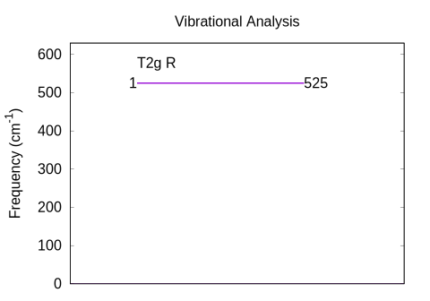

振動解析：Si単結晶
=

# 概要

赤外ならびにラマン分光を筆頭に、格子振動は固体物理学において重要な地位を占めています。
第一原理計算を利用すれば、格子振動のシミュレーションが可能です。

安定な配置から原子を変位させたときに原子に作用する力を、第一原理計算により求めます。
変位量と力の関係から、原子を繋いでいる「バネ定数」を求めることをイメージしてください。
原子は周囲の原子と複数のバネで繋がっています。
解析のためには動力学行列を作成し、それを対角化することにより固有値（固有振動数）と固有ベクトル（振動モード）を求めます。
振動解析では原子の質量が結果に本質的な影響を及ぼします。
質量を正しく設定する必要があることにご注意ください。

# 振動解析

振動解析の計算では、最適化済みの安定な原子配置を入力ファイルで指定します。

入力で与えた安定な配置では原子に作用する力が（理想的には）ゼロであり、そこから原子を変位させたときに生じる力を電子状態計算により求めます。
また、原子の`mobile`属性を`on`にしてください。
過去のバージョンのPHASE/0では、振動解析では全ての原子を対象にすることが前提であったので`mobile`属性の指定は重要ではありませんでした。
`PHASE/0 2020.01`で一部原始のみの振動を解析する機能が実装されましたので、それ以降、振動解析の対象原子を`mobile`属性で示すことが必須になりました。

原子の質量は`element_list`ブロック内で指定します。

```
element_list{  #units atomic_mass
               #tag  element  atomicnumber dev mass
                     Si       14           1.2 28.0855
            }
```

質量の単位の既定値は原子単位です。
分かりやすい単位ではないので、`#units atomic_mass`を指定して原子質量単位に切り替えています。
質量の値は`28.0855`です。

入力ファイルで以下のように指定することにより、自動的に原子を変位させた力の計算が実行されます。

```
Phonon{
   sw_phonon = on
   sw_calc_force = on
   displacement = 0.1
   sw_vibrational_modes = on
}
```

変位量は`displacement`で与えます。上記例では、0.1 bohr変位させます。

入力で与えた原子配置の対称性が高くても、電子状態計算の際に原子を変位させますので、対称性が低下します。
電子状態計算における対称性を利用したk点の削減が効きませんので、k点が多くなる傾向があり、k点並列を多くすると有利です。

```sh
$ mpiexec -np 4 ../../../bin/phase ne=1 nk=4
```

この例では、k点数は32です。
入力ファイルで指定した`4 x 4 x 4`は64ですが、時間反転対象性を利用して、その半分になるからです。

```sh
$ grep kv3 output000
 !kp kv3 =       32 nspin =     1
 !kp kv3 =       32 CRDTYP =   2
$
```

振動解析では、空間群は原子の変位パターン数の削減に利用されます。
対称性を利用しなければ、各原子x, y, zの三方向に±&Delta;ずつ変位させますので、原子数の6倍の変位パターンを調べる必要があります。
対称性（空間群）を利用すれば、等価な変位を計算する必要がなく、変位パターン数を削減できます。
削減後の変位パターン数、すなわち、力の計算回数は、`output000`等に出力されます。

```
 PHONON: number of force calculations =     2
```

対称性を利用しなければ12回の計算が必要ですが、対称性を利用した結果、必要な計算は2回にまで削減されました。

計算が終了すると、原子の変位と力の計算結果が`force.data`に、振動モード解析の結果が`mode.data`に、それぞれ出力されています。
`mode.data`から、振動準位の図を作成します。

```sh
$ ../../../bin/freq.pl mode.data
```
振動準位図`freq.eps`が出力されます。



- 振動モードが一つあること
- この振動モードはラマン活性`R`であること
- その振動数は525 cm<sup>-1</sup>であること

を示しています。

