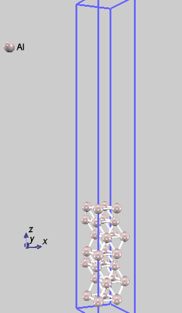
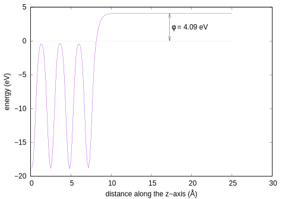
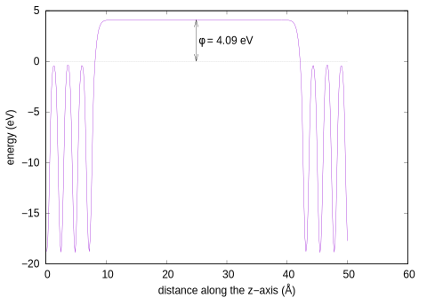

# 仕事関数

## 概要

固体物理分野では、三次元周期境界条件を前提とするシミュレーション手法が多く利用されます。
そのような計算手法で**表面**を扱う際には、**スラブモデル**を用います。
それは下図のように、真空層（原子が存在しない領域）を挟んだスラブの周期構造です。
真空層を介したスラブ間の相互作用が無視できる程度に小さければ、**表面**を解析しているとみなすことができます。



入力ファイルに記述されている原子位置は、反転対称性を利用できるように、格子の境界をはみ出すように記述されています。
上図では見やすいように、表面垂直（<i>z</i>軸）方向に10Å並行移動させて表示しました。

PHASE/0のように平面波基底を採用している計算手法では、原子が存在しない真空層も計算負荷です。
ある程度の大きさは必要ですが、大きくし過ぎないように注意してください。

## 入力ファイル

仕事関数を計算するためには、`postprocessing`ブロック内に以下の記述を追加します。

```C
postprocessing {
        workfunc {
                sw_workfunc = on
                sw_add_xc_to_vloc = off
        }
}
```

`sw_workfunc = on`は局所ポテンシャル（電子が感じるポテンシャル）をファイル出力するための指定です。
真空層（理想的には表面から無限遠方）での、局所ポテンシャルを評価する際に利用します。
表面から遠く離れた**真空領域**では、電荷密度は無視できる程度に低いことが期待できます。
電荷密度がゼロであれば、交換相関ポテンシャルも**ゼロ**ですので、それを期待して交換相関項を局所ポテンシャルに含めない指定が`sw_add_xc_to_vloc = off`です。

PHASE/0配布物に含まれるサンプルを一部改変しました。

[nfinp.data](./nfinp.data)

- a, b軸の成す角度を、60度から120度に変更しました。：六方晶として扱うため
- 反転対象位置にある原子が顕に記述されていない（反転対称性利用；`sw_inversion = on`, `weight = 2`）のを、全ての原子位置を明記しました。：反転対称性を利用しない計算と比較するため
- k点分割数を`4x4x1`から`6x6x1`に増やしました。：収束が不十分だったため

## 計算実行と解析

```sh
mpiexec -np 2 ../../../../bin/phase ne=1 nk=2
../../../../bin/workfunc
../../../../bin/workfunc.pl nfvlcr_av.data
```

`workfunc.eps`が出力されます。



横軸は<i>z</i>座標、縦軸は、<i>x-y</i>平面内で局所ポテンシャルを平均した値です。
反転対称性を利用した計算では、<i>z</i>方向に格子の半分まで表示されます。
ポテンシャルが平坦になれば、表面から十分に離れた**真空準位**とみなして良いでしょう。
一方、電子が占めている最高エネルギー準位は**フェルミエネルギー**です。
その値は`nfefermi.data`に書き出されており、上記グラフでは水平な点線で描画されています。
そして、真空準位とフェルミエネルギーの差が仕事関数です。


反転対称性の利用をやめて、最初から計算し直してみましょう。

```C
                sw_inversion = off
```



<i>z</i>方向に格子一周期分の結果が表示されました。
もちろん仕事関数の値は、（計算誤差の範囲内で）反転対称性を利用した計算と一致します。

<!-- ## ギャップがある系でのフェルミエネルギー

フェルミエネルギーの決定
真性半導体やp型半導体では、価電子帯の電子が
ｎ型半導体であれば、電子は伝導帯にいて、そこから飛び出します。 -->