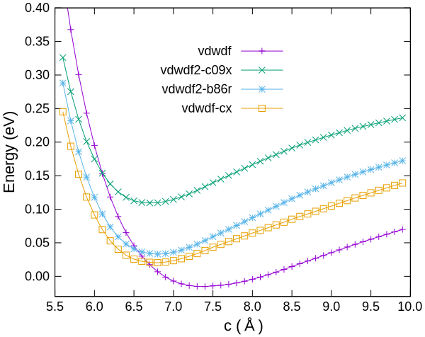

# ファン・デル・ワールス相互作用（電子状態計算）

第一原理電子状態計算は厳密ではなく、いくつかの近似の上に成り立っています。
特に電子相関を厳密に扱うことは難しく、交換効果と併せて、**交換相関ポテンシャル**を近似する方法が実用的に用いられています。
そして現在、固体材料分野で最もよく使われる交換相関ポテンシャルはGGAですが、これはファン・デル・ワールス相互作用（以下、vdWと記す）を含みません。

伝統的な半導体材料等ではvdWを無視して致命的な影響はありませんが、近年は、グラフェンを筆頭とする層状物質が新規デバイス材料候補として注目を集めており、このような材料の第一原理計算ではvdWを考慮することが強く望まれます。
また、固体表面への分子吸着においても、vdWの効果を無視することが妥当でない場合があります。
このような状況に対応できるように、PHASE/0はvdW解析機能を備えています。

計算負荷と正確さのバランスを考慮して、大きく異なる二つのvdW計算手法があります。

- 原子配置のみから決める方法：
vdWを経験的なパラメータを用いて表現します。
経験的なパラメータを用いるのですが、古典分子動力学のように原子間のあらゆる相互作用を経験的に記述するのではなく、（比較的単純であることが期待される）vdWのみをパラメータで記述して補正しますので、本手法も第一原理計算の範疇に含めることが一般的です。
DFT-D2, DFT-D3などの流儀があります。

- 電子状態から求める方法：
電子状態からvdWを評価する、真の第一原理計算です。
vdW-DFなどと呼ばれ、複数の汎関数が提案されています。

後者のvdW-DFは、さらに二つに分類できます。

- oneshot版：SCFが収束した後に、vdWの補正値を求めます。
- SCF版：vdWを考慮したSCF計算を行います。

以下ではvdW-DFの二つの方法を、グラファイトに適用します。
グラファイトは蜂の巣状の層が、vdWを介して積み重なっています。
GGAはvdWを含まないため、積層方向の格子長さを適切に求めることができませんが、vdWを考慮することによって実験値に近づくことが知られています。

## oneshot版

PHASE/0 2021.02付属のサンプルは、oneshot版のみが提供されています。
SCF計算終了後に、vdWによるエネルギー補正値を求めます。
力の計算に対応していないため、構造緩和ができません。
次に述べるSCF版と異なり、汎関数は`vdwdf`のみが利用可能です。

c軸長さを名前とするディレクトリに、格子定数を変えたサンプル入力ファイルが用意されていますので、全て実行します。
vdW補正後のエネルギー値は、output000に、以下のように書き出されています。

```C
** 'oneshot' calculation of the vdW-interaction **

-- parameters for the vdW-DF calculations --
   rmax, kmax, nmesh     :   56.7000000000  52.9100529101    3000
   dq, lambda, and q0cut :    0.0500000000   1.0300000000   3.0000000000
   q0min, q0max, nq0     :    0.0900000000   3.0300000000   35
   ds                    :    0.0500000000
   na_gl, a1, a2         :    30   0.0000000000  60.0000000000
   kernel evaluation     : by interpolation
   ndel, nphiD           :      200    1000
   sw_use_WuGygi_method :   0
--> total energy :       -22.8779143357 hartree
```

`nfefn.data`にも同じ値が出力されています。

全エネルギーのc軸長さ依存性を図示します。
グラファイトのc軸長さは、約7.4Åと求まりました。
実験と一致している、とは言い難いですが、GGAと比較すると大幅に改善しています。


## SCF版

PHASE0付属のサンプルはoneshot版のみでしたが、少し変更すればSCF版の計算ができます。

```diff
    vdwdf{
-       mode = oneshot
+       mode = scf
    }
```

併せて`xctype`を指定します。
利用可能な汎関数がマニュアルに列挙されています。
その中から`vdwdf`, `vdwdf2-c09x`, `vdwdf2-b86c`, `vdwdf-cx`を試します。

今回は利用しませんが、SCF版は力の計算に対応しており、vdWを考慮した構造緩和ができますので、oneshot版よりも利用範囲は広がるでしょう。
ただし、ストレス計算には未対応なため、格子の（自動）最適化はできませんのでご注意ください。
グラファイトの単位格子を、a, b軸長さを2.48 Åに固定し、c軸長さのみを変更した複数の計算を実行し、その全エネルギーを求めます。
格子定数を変更した入力ファイルをたくさん準備するのは面倒なので、シェルスクリプトを利用して自動実行します。
`samples/vdWDF/graphite/`にディレクトリ（例えば`scf`）を作成し、その中に下記二つのファイルと、`c6.1`などの含まれる`file_names.data`をコピーします。

[入力ファイルテンプレート](./nfinput.data)
[シェルスクリプト](./scan.sh)

`scan.sh`を、`phase`実行ファイルの位置など調整（編集）してから、実行します。

```sh
phase=~/phase0_2021.02/bin/phase
```

格子定数を変更した計算が順番に実行され、格子定数とそのエネルギーの組が`data.txt`ファイルに出力されます。
各汎関数の全エネルギーのc軸長さ依存性を示します。
エネルギー原点は汎関数に依存しますので、比較しやすいように汎関数毎にエネルギーをシフトして表示しました。
異なる汎関数のエネルギーを比較することに意味はありません。
エネルギーが最小になるのが、各汎関数での安定なc軸の長さです。



`vdwdf`は実験値よりも長い格子定数を示しましたが、それ以外の三つの汎関数は、実験値の格子定数を再現しています。
