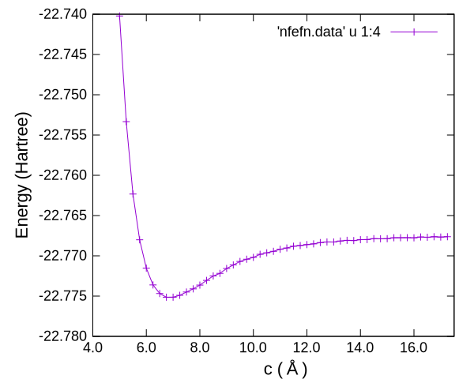

# ファン・デル・ワールス相互作用（経験的パラメータ利用）

第一原理電子状態計算は量子力学を厳密に解くのではなく、いくつかの近似の上に成り立っています。
特に電子相関を厳密に扱うことは難しく、交換効果と併せて、**交換相関ポテンシャル**を近似する方法が実用的に用いられています。
そして現在、固体材料分野で最もよく使われる交換相関ポテンシャルはGGAですが、これはファン・デル・ワールス相互作用（以下、vdWと記す）を含みません。

[こちら](../../vdWDF/graphite/README.md)では、電子状態から求めるvdWを紹介したのに対して、ここでは**原子配置から経験的なパラメータを用いて**vdW補正項を求める手法の一つであるDFT-D2, D3を紹介します。
経験的なパラメータを用いますが、古典分子動力学のように原子間のあらゆる相互作用を経験的に記述するのではなく、（比較的単純であることが期待される）vdWのみをパラメータで記述して補正しますので、本手法も第一原理（非経験的）計算の範疇に含めることが一般的です。

以下ではvdW-DFと同様に、グラファイトの面間距離（c軸長さ）を評価します。

## スクリプト実行

本サンプルは、

- 入力ファイルテンプレート`nfinp.data`
- テンプレートからc軸長さを書き換えてPHASE/0入力ファイルを作成し、それを順次計算実行するスクリプト`run.sh`

から構成されています。
テンプレートでは、DFT-D3を利用するように設定されています。
`run.sh`を実行すると、c軸長さ毎にサブディレクトリを作成（例えばc軸長さ6.00 Åに対して、ディレクトリ`c6.00`）し、そのディレクトリ中でSCF計算を実行します。
そして収束したエネルギー値を、カレントディレクトリ（`run.sh`と同じ場所）の`nfefn.data`にまとめます。

### 実行方法1

```sh
sh run.sh
```

### 実行方法2

```sh
chmod +x run.sh
./run.sh
```

### 実行方法3

macOSでは、上記実行方法1,2は意図した動作をしません。
スクリプト内の`echo`コマンドの動作が異なるためです。
次のように実行してください。

```sh
bash run.sh
```

（参考）[echoコマンドの移植性が低い歴史的理由とPOSIXの改定方針 ～ 次期POSIXでbashのechoはPOSIX準拠になる！](https://qiita.com/ko1nksm/items/a1dcf6cbb84e50520eee)

スクリプトが正常に終了すると、カレントディレクトリのnfefn.dataは以下のようになっています。

```C
5.0     1      12      -22.7402158515        0.0000000000
5.25     1      12      -22.7533371582        0.0000000000
5.50     1      13      -22.7623266960        0.0000000000
5.75     1      13      -22.7680089417        0.0000000000
6.00     1      13      -22.7715297149        0.0000000000
6.25     1      13      -22.7736122534        0.0000000000
6.50     1      15      -22.7746807339        0.0000000000
6.75     1      15      -22.7751399148        0.0000000000
7.00     1      15      -22.7751358119        0.0000000000
7.25     1      15      -22.7749016138        0.0000000000
7.50     1      14      -22.7744932494        0.0000000000
7.75     1      15      -22.7741014161        0.0000000000
8.00     1      15      -22.7736330150        0.0000000000
（以下略）
```

一列目がc軸長さ、四列目が全エネルギーです。
それをグラフ描画します。



グラファイトの格子定数を適切に表現しています。