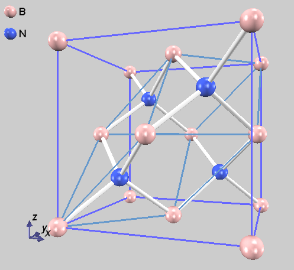
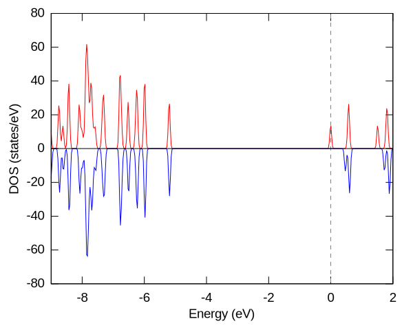

# PHASE-Viewer実習

窒化ホウ素を題材にした、PHASE-Viewerを利用するPHASE/0の計算実習です。

## 窒化ホウ素（立方晶）の状態密度とバンド構造図

動画 [Part1](https://vimeo.com/946141605)

[サンプルproject](https://github.com/matelier/moku-moku/raw/master/practice_phaseViewer/pvsamples.tar.xz)

閃亜鉛鉱型窒化ホウ素（cBN）の電子状態を調べます。
結晶（繰り返し）構造の最小単位は、2原子（B, N各1原子）で構成される面心基本格子です。

## スピンを考慮した計算；ドナー不純物

動画 Part2 [前半](https://vimeo.com/991132934) [後半](https://vimeo.com/994463954)

PHASE-Viewerを操作してcBNのスーパーセルを作成し、一つのB原子をSiに置換します。

構造緩和計算を実施します。
元素を変更すると、原子に力が働くようになります。
力が作用する方向に原子を変位させるとエネルギーが低下します。
原子に作用する力が十分に小さくなるように、安定な原子配置を求めます。

対称性（空間群）を利用しません。
対称性を利用すると、k点数の削減が効き、計算負荷が下がるので良さそうに見えますが、構造の探索範囲が狭くなる（対称性を保つ範囲に限定される）ことが欠点です。

スピン自由度を考慮します。
（価）電子数が奇数の場合は、スピン分極が重要でなくても、電子の詰まり方を制御する目的でスピンを考慮して計算した方がよい場合があります。

（参考）対称性を利用すると（k点並列数は`2`にしてください）、構造緩和後のエネルギーが少し高くなります。
これは、対称性を利用しない方が安定な構造（原子配置）に到達していることを意味します。

| 対称性利用 | kv3 | エネルギー (Hartree) |
| :-------: | :-------: | :-------: |
| なし | 16 | -412.8437287267 |
| あり | 4 | -412.8382771969 |

全く同じ数値にならなくても良いです。
小数点以下三桁まで一致すること、`対称性利用なし`の方が安定であること、を確認してください。

状態密度から、Siがドナー不純物であることがわかります。

この計算は、不純物濃度が現実と比べて高過ぎることもあり、精密には程遠いです。
適切な解析には、不純物濃度を下げるために、もっと大きなスーパーセルを用いることが望まれます。

[補足説明](https://www.docswell.com/s/matelier/KN1M9V-2024-07-17-192122)

## CIFからの計算；窒化ホウ素（六方晶）のエネルギー比較

動画 [Part3](https://vimeo.com/997279627)

[Materials Project](https://next-gen.materialsproject.org/)から二つの結晶構造（CIF）を入手して、それぞれ全エネルギーを求めます。
両者の安定性を比較します。

CIFを入手するためには、Materials Projectへのログインが必要です。

[mp-984](https://materialsproject.org/materials/mp-984)

[mp-7991](https://materialsproject.org/materials/mp-7991)

どちらも、B-Nが蜂の巣構造を形成していることは同じですが、原子層の重なり方が異なります。

| mp | エネルギー (Hartree) |
| :-------: | :-------: |
| 984 | -25.7563074476 |
| 7991| -25.7551759127 |

計算機環境や並列数によって計算結果に多少の差異が生じます。
`984`の方が安定であること、を確認してください。
