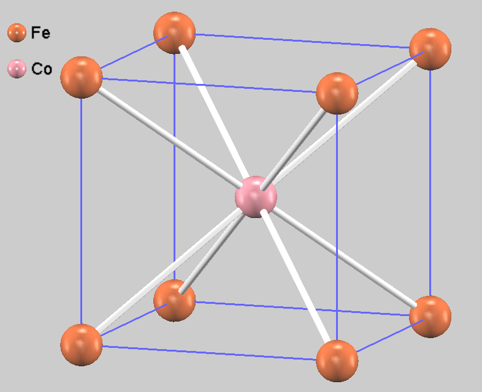
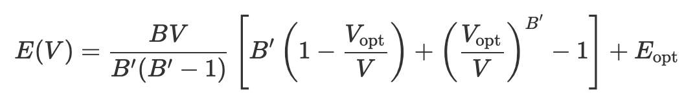
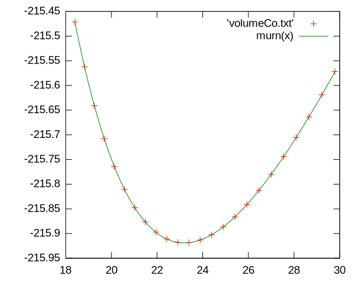

自動計算（簡易版；シェルスクリプト利用）
=

シミュレーション利用に慣れて役に立つ結果が得られるようになると、少しだけ条件が異なる、良く似た計算を複数実行したくなることがあります。
その際、個別に入力ファイルを書き換えて計算実行するのは面倒なだけの単純作業ですし、ミスを避ける観点からも自動処理が好まれます。
PHASE/0（に限らず、多くの材料シミュレーションソフトウェア）の入力ファイル（テキスト）とコマンド実行方法は公開されていますので、自動処理の実現に原理的な困難はありませんが、プログラム作成が必要になると、何から手をつければ良いのかわからない材料研究者がいらっしゃるのではないでしょうか。

本文書では、単純な自動処理の実現を目的として、シェルスクリプトを利用した計算実行を紹介します。

シェルは、Bourneシェル系と、csh系に大別されます。ここでは、前者のみを対象とします。
古より、cshでスクリプトを書くのは良くない作法と言われています。

[なぜcshでプログラムを書くのが良くないのか](http://www.speech-lab.org/~hiroki/csh-whynot.euc)

# 利用環境

## Linux

シェルスクリプトはUnix文化の一部です。
Linuxには利用環境が備わっています。

## Windows

Windowsでシェルスクリプトを利用する場合は追加ソフトウェアが必要です。

- busybox
- Git bash
- WSL

その他、mingwやcygwinを利用しても、Linux環境の使い勝手がほぼ実現できます。

### busybox

複数の手段がある中で、最も簡単な手順で導入できるのはbusyboxです。
ファイル（バイナリ）をダウンロードして、パスが通ったフォルダ（ディレクトリ）に配置します。

 [busybox-w32](https://frippery.org/busybox/)

（PHASE/0などのシミュレーション実行環境が整った）コマンドプロンプトから

```
> busybox.exe bash
```

で起動すると、PHASE/0関連の設定が整った状態で、シェルスクリプトの実行が可能になります（bashの対話利用）。

各コマンドには完全な機能が備わっておらず、Unixコマンドの一般的な説明が該当しないことがありますので注意してください。
（POSIXへの準拠よりも、組み込み用途向けにコンパクトなバイナリを提供することが優先されているようです。）

### Git bash

バージョン監理システムGitのWindows版をインストールすると、bash.exeもインストールされます。

[Git for Windows](https://gitforwindows.org/)

### WSL

WSL (Windows Subsystem for Linux) は、その名の通りWindows環境で動作するLinuxです。
Linuxとして利用することに加えて、WSLからWindowsネイティブのコマンドを実行することも可能です。

## macOS

macOSに付属のターミナルは、Unix的に利用できます。
シェルスクリプトの利用に際して、追加ソフトウェアのインストールは不要です。

システムに標準インストールされているbashはバージョンが古いです。
問題が生じることはないと思いますが、困った時は思い出してください。

https://qiita.com/ko1nksm/items/59c2e8a7afa969af8212

# 対話利用

シェルはスクリプト実行環境としてだけでなく、対話的な操作にも利用します。
シェルスクリプトは、シェルの対話環境から実行するのが一般的ですので、対話利用の基礎も説明します。
Windowsのコマンドプロンプトのように、ディレクトリを移動しながら、各種コマンドでファイルを操作します。
主なコマンドを下表に示します。

入力の際には、コマンド／ファイル名どちらもタブで補完できます。
いくつかの文字を入力してタブを押すと、候補が一つだけの場合は残りの文字が補完されます。
候補が複数ある場合は共通部分が全て補完され、さらにもう一度タブを押すと候補一覧が表示されます。
長いファイル名を入力する際に便利ですし、コマンド名の記憶があやふやな場合や間違いを防止する意味でも積極的に利用しましょう。

|コマンド|機能|
|:--:|:--|
| cd | ディレクトリ名を引数に与えると、そのディレクトリに移動します。引数無しで実行すると、ホームディレクトリに移動します。「cd \.\.」で一階層上のディレクトリに、「cd -1」で直前にいたディレクトリに、それぞれ移動します。 (change directory) |
| pwd | 現在のディレクトリをフルパスで表示します。コマンドプロンプトのcdを引数無しで実行した場合に相当。(print working directory) |
| ls | ファイルとディレクトの一覧表示。コマンドプロンプトのdirに相当。 (list) |
| cp | 第一引数のファイルを第二引数の名前にコピーします。第二引数がディレクトリの場合は、そのディレクトリにそのままのファイル名でコピーします。 (copy)|
| mv| ファイルを移動します。ファイル名変更もこのコマンドを使います。(move) |
| rm | ファイルを削除します。コマンドプロンプトのdel相当。(remove) |
| rmdir | 空のディレクトリを削除します。 |
| less | テキストファイルの閲覧（ページャ）。コマンドプロンプトのmore相当（高機能版）。スペースキーで次ページへ移動。カーソルキーで上下移動。qで終了。 |
| cat | ファイルの内容出力。短いファイルの内容確認に使います（長いファイルはlessを使いましょう）。コマンドプロンプトのtype相当。(concatenate) |
| chmod | 「+x」オプションと共に利用し、シェルスクリプトのテキストファイルに実行属性を与えます。```chmod +x shellscript.sh```(change mode) |
| vi | テキストエディタ。終了方法を知らない人は起動しないでください。 |

# 正規表現の基礎

上記コマンドの引数には、具体的な文字列だけでなく、文字列が満たす条件を記述することができます。
その文法規則が正規表現であり、コマンドの表現が豊かになり、複雑な処理を簡潔に記述できます。
Windowsコマンドプロンプトのワイルドカードの（超）高機能版のようなものです。
詳細はコマンド毎に異なりますので、代表的な表現のみを示します。

|正規表現|意味|
|:--:|:--|
|?|任意の一文字|
|*|任意の文字列|
|[...]|いずれか一文字|
|*|0回以上の繰り返し|
|+|1回以上の繰り返し|
|\t|タブ|
|\n|改行|
|$|行末|

利用例をいくつか示します。

|例|意味|
|:--:|:--|
| output??? | output000, output001, ...や、outputABC, ouput#+!など
| continue* | continue.data, contiue_bin.data, continue_bin_paw.dataなど
| a[abc]d | aad, abd, acdのいずれか
| [ \t]+ | タブもしくは空白文字だけから構成される1文字以上の文字列
| [0-9]$ | 数字で終わる文字列

# シェルスクリプト基本

自動計算に役立つと思われる事柄に絞って説明します。

## 基本

繰り返し実行する作業手順をファイルに記述します。
原則として一行目から順番に処理されます。
\#から行末まではコメントとして扱われます。
ファイルの一行目に以下のように書くと、シェルスクリプトであることが明確です（シェバンshebangと呼ばれ、実行時のインタプリタを指定します；この例ではbash）。

``` sh
#!/bin/bash
```

（Windowsの）コマンドプロンプトと異なり、スクリプトが配置されているディレクトリにおいてファイル名を与えるだけでは実行されません。
カレントディレクトリのスクリプトを実行する場合にも、ファイル名だけでなくパス（「.」はカレントディレクトリ）の指定が必要です。

```
$ ./scriptfile.sh
```

Unix文化では、カレントディレクトリは実行ファイル探索の対象ではありません（環境変数PATHにカレントディレクトリを含めません）。

## リダイレクトとパイプ

特に指定しなければ、コマンドの実行結果は画面（標準出力）に書き出されます。
出力先をファイルに変更することを「リダイレクト」と呼びます。

``` sh
command > output_file
```

この例ではファイルoutput_fileが上書き出力されます。
既存ファイルに追記する場合は「>」の代わりに「>>」を使います。

コマンド入力をファイルから受け付けるのもリダイレクトです。
実行時の引数でファイルを指定できる場合（多くのコマンドで可能）は、そちらを利用しましょう。

``` sh
command < input_file
```

この例では、実行結果は画面に出力されますが、入力と出力の両方をリダイレクトできます。

``` sh
command < input_file > output_file
```

コマンドの（標準）出力を、次のコマンドの（標準）入力につなぐのが「パイプ」です。

``` sh
command1 arg0 arg1 | command2 arg2 > file
```

command1で処理された結果が、command2の入力となって処理されて、その結果はfileに出力されます。
パイプは何段でも繋ぐことができます。
単機能のコマンドをパイプでつないで複雑な処理を実現するのがUnixの流儀です。

標準出力とは別に「標準エラー出力」も用意されています。
その名の通り、エラーなど異常な動作を通知する仕組みです。
規定値は「画面」になっており、標準出力をファイルにリダイレクトしただけでは、標準エラー出力は画面に表示されます。
これをファイルにリダイレクトするためには「2>」を指定します。

``` sh
command > outputfile 2> error
```

標準出力と標準エラー出力の両方を一つのファイルに出力するためには、「2>&1」を指定します。

``` sh
command > outputfile_with_error 2>&1
```

## 変数（とechoコマンド）

英数字は変数名として利用できます（ただし一文字目は英字のみ；数字不可）。
利用に際して宣言は不要です。
変数に型はありません。
代入の「=」の前後に空白を入れると正常に動作しませんので注意してください。
変数を参照する際には、変数名の前に$を付けます。
readonlyを付けて変数を定義すると更新できないので、定数として利用できます。

``` sh
x=3.14
echo $x  # echo "$x"も可。echo '$x'は文字列「$x」を出力。
```

echoは文字列を表示する（標準出力に送る）コマンドです。
変数名に$をつけて引数に与えると、変数の内容を表示します。
パイプでつなぐと、echoコマンドの出力が次のコマンドの入力になります。

## コマンド実行結果の取得

スクリプト中で\`...\` (バッククォート)で処理を囲むと、その処理結果に置き換えられます。

``` sh
now=`date`
echo $now
```

dateコマンドの実行結果（現在日時）が変数nowに格納されて、次のechoコマンドでその内容を表示します。

## 入力ファイルの書き換え（sedコマンド）

計算自動実行に際してはテンプレートファイルを用意して、それを（一部）書き換えた計算実行用のファイルを作成します。
次のコマンドは、テンプレートファイルnfinput.data中の文字列「$1」を全て変数aの値で置き換えたnfinp.dataファイルを生成します。

``` sh
sed 's/$1/'$a'/g' nfinput.data > nfinp.data
```

正規表現を活用すると、高度な処理を実現できます。
例えば連続する空白文字（空白とタブ）を単一の空白文字に置き換えるには、以下のように利用します。

``` sh
sed -E 's/[ \t]+/ /g' input_file
```

置き換えた結果は、標準出力に書き出されます。

## シーケンス

後述のループでの利用を想定して、等差数列を生成します。
格子定数を変更した多数の計算を実行する場合が典型的な利用場面です。

``` sh
seq 1 2 10
```

は、1から2刻みで10までの数列を生成します。
実行結果は以下の通りです。

``` sh
1
3
5
7
9
```

終値10を超える値は出力されないので、9で終了します。
刻み幅が1の場合は、二番目の数字は省略できます。
また、実数も利用できます。

## ループ

複数の条件で計算実行する際には、条件項目を変数としてループを構成します。

``` sh
for i in 1 2 3
do
【実行内容】
done
```

【実行内容】が、変数$iを1, 2, 3として順番に実行されます。
ループする変数は数値だけでなく、文字列も利用できます。
等差数列でのループには、シーケンスが便利です。

``` sh
for i in `seq 1 10`
do
【実行内容】
done
```

変数$iを1, 2, 3, 4, 5, 6, 7, 8, 9, 10と変化させながら、【実行内容】が実行されます。

## 条件分岐

条件分岐にはif文を使います。

unameコマンドはシステムの情報を表示します。
以下の例では、uname実行結果に応じて、異なる文字列を表示します。
その他多くのプログラミング言語と異なり、「\[」は一つのコマンドです。
そのため前後に空白が必要です。

``` sh
if [ `uname` = "Windows_NT" ]; then
    echo "busybox"
elif [ `uname` = "Linux" ]; then
    echo "Linux"
elif [ `uname` = "Darwin" ]; then
    echo "macOS"
else
    echo "cygwin or something."
fi
```

複雑な条件分岐を利用する場合は、Pythonなどの高水準言語を使うことをお勧めします。

## 関数

関数（サブルーチン）も利用できます。

``` sh
function_name () {
  local x=10000
  echo $x $1 $2
}
function_name asms matelier
```

関数はそれを利用するよりも先に（前の行で）定義されていなければなりません。
関数内でのみ有効なローカル変数も利用できます（2行目）。
ただし、readonlyのグローバル変数と同じ名前のローカル変数は利用できません。
localを付けない場合はグローバル変数となり、他の関数から参照／更新できます。
引数は\$1, \$2, ...で参照します。
標準出力で結果を返すのが正統な使い方（3行目）ですが、（使い難いので；実用上は）グローバル変数やファイル出力で結果を返すこともあります。

## 四則演算と少しの数学関数

歴史的にはdcが基本的なコマンドとして存在し、bcコマンドはそのフロントエンドとして作成されました。
現在のbcは独立したプログラムとして実装されていることが多いようです。
また、bcはPOSIXで標準化されているので多くのシステムで利用できますが、**busyboxでは利用できません。**
そして、busybox-w32のdcコマンドは、GNU dcとは動作が異なります。
LinuxとWindows (busybox-w32)の両方で同じ動作をさせることが難しいので、個別に説明します。
なお、スクリプト中で計算結果を変数に代入する場合は、dcもしくはbcを含むコマンド全体をバッククォートで囲んで=の右辺に記述します。

### busybox-w32向け；dc

フロントエンドが作成された歴史から予想される通り、万人向けとは言えません。
計算式を逆ポーランド記法で記述します。
例えば次式

$$
\frac{2.2-1}{2.2+1}
$$
の値を求めるコマンドを以下に示します。
echoコマンドが計算式を標準出力に書き出し、それをパイプで繋げてdcコマンドへの入力としています。

``` sh
echo "2.2 1 - 2.2 1 + / p" | dc
```

逆ポーランド記法は「スタック」を念頭に解釈します。
数字はその値をスタックに積む命令で、演算記号（二項演算子）はスタックから二つの値を取り出して演算し、結果をスタックに積む命令です。
最後のpで、スタック一番上の値を出力します。

### その他環境（Linux等）向け；bc

bcコマンドでは、先ほどの式は次のように計算します。

``` sh
echo "scale=10; (2.2 - 1) / (2.2 +1)" | bc
```

scaleは演算精度の指定です（無指定の場合は整数演算；後述の「-l」オプションが指定された場合は20）。
いくつかの数学関数が用意されています。
平方根はsqrtです。
立方根は指数関数(e)と対数(l; エル)を組み合わせて求めます。その際、bcコマンドに「-l（エル）」オプションを指定してください。

``` sh
echo "scale=10; sqrt(3.2)" | bc
echo "scale=10; e(l(8)/3)" | bc -l  # 8の立方根は「2」
```

$$
\sqrt[3]{a}=e^{\frac{1}{3}\log(a)}
$$

cygwinでは、Mathカテゴリーにbcパッケージがあります。

### 整数演算

整数演算に限ると、Windows (busybox)とLinux共通でexprコマンドが利用できます。

``` sh
expr 4 + 5  #  9
expr 10 / 3  # 3
expr 10 \* 3  # 30
```

演算子の前後に空白が必要です。
また、掛け算「*」は「\」でエスケープします。

## 計算結果ファイルからの数値抽出

計算結果のテキストファイルから、目的とする文字列を抽出します。

### grepコマンド

指定する文字列が含まれている行を抽出します。
PHASE/0の出力ファイルoutput000には、繰り返し計算の過程での全エネルギーが「TH」という文字列を含む行に出力されています。
そこで、「TH」を含む（正規表現にマッチする）行のみを抽出すると、全エネルギーの変化、すなわち収束の様子を確認することができます。

``` sh
grep TH output000
```

実行結果例を以下にします。

```
 TOTAL ENERGY FOR     1 -TH ITER=   -140.717847718204  edel =  -0.140718D+03 : SOLVER = SUBMAT + PKOSUGI : Charge-Mixing = BROYD2
 TOTAL ENERGY FOR     2 -TH ITER=   -141.794584557601  edel =  -0.107674D+01 : SOLVER = SUBMAT + PKOSUGI : Charge-Mixing = BROYD2
 TOTAL ENERGY FOR     3 -TH ITER=   -142.668995086579  edel =  -0.874411D+00 : SOLVER = SUBMAT + PKOSUGI : Charge-Mixing = BROYD2
...
```

「-A 数値」オプションを付けると、該当した行から、数値で指定した行数だけ後ろまで出力します。
目印となる文字列と結果数値が異なる行に出力されている場合に利用します（例えばPHASE／0では応力値の抽出）。
「-n」オプションを付けると、出力の先頭に入力ファイルにおける行番号がつきます。

### tailコマンド

ファイル（もしくは標準入力）の最後の数行を取得します。
行数は「-n」オプションで指定します。
SCF計算における全エネルギーのように、計算の途中で更新される値の最後の結果を取得する場合に利用します。

``` sh
grep TH output000 | tail -n 1
```

### cutコマンド

入力行から、特定の部分を取り出します。

「-c」オプションでは、文字数を指定して取り出します。

``` sh
echo "1234567890" | cut -c 3-5  # 345
```

文字列”1234567890”の3から5文字目を取り出した結果、「345」となります。

「-f」オプションでは、区切り文字行を項目に分割し、指定した順番の項目を抜き出します。
区切り文字の規定値はタブです。
空白文字で区切る場合は「-d " "」オプションで区切り文字を指定します。

``` sh
echo "a b c" | cut -f2 -d " "  # b
```

空白文字区切られた三つの項目a, b, cから二番目を取り出しますので、実行結果は「b」です。
「a」の前に空白文字が入ると、その前の空文字列が一番目にマッチするため、二番目は「a」になります。
計算結果テキストファイルの各行が空白文字で始まることは良くありますのでご注意ください。

連続する空白文字は、そのそれぞれが区切りとして認識されます。
連続する空白文字を単一の区切りにすることは、sedコマンドで連続する空白文字を一つのタブに変換して実現します。

``` sh
echo "a  \t   b       c" | sed -E 's/[ \t]+/\t/g' | cut -f2  # b
```

# 利用例

Fe, Co, Niなどの3d遷移金属から成る合金の磁気モーメントは、合金の詳細には依らず、一原子当たりの電子数で概ね決まると言われています（スレーター－ポーリング曲線）。
これに関連して、FeとMnもしくはCoとの1:1合金を模擬する単純な計算をします。
体心立方Bravais格子の角にFe、中心にMn, Fe, Coのいずれかを配置した結晶構造について全エネルギーの体積依存性から、最安定な格子定数を求めます。



参考情報：[3d遷移金属から成る合金の磁気モーメント](http://www.asms.co.jp/application/ciao.html#VCA)

## PHASE/0入力ファイル（テンプレート）

### nfinput.data

[PHASE/0入力ファイルテンプレート nfinput.data](example/nfinput.data)

体心格子の角にFeが配置され、中心にはMn, Fe Coが順番に配置されます（31, 38行目の元素記号\$2、38行目の原子番号\$3）。
各元素について、格子定数を変えた（20行目\$1）計算を実行します。


様々な条件の計算を実行すると、中には収束し難い条件があるかも知れません。
収束しない計算は適当なところで打ち切って残りの計算を実行したいので、4行目でSCF計算回数を制限しています（この例では対称性により原子に力が作用しないため、電子状態が収束したとみなされると計算終了です）。

### file_names.tmpl

3行目のF_POT(2)は、計算する元素に合わせて順番にMn, Fe, Coの擬ポテンシャルファイルに置き換えられます。

```
&fnames
F_POT(1) = 'Fe_ggapbe_paw_02.pp'
F_POT(2) = '$ppfile'
/
```
上記二つのファイルから、以下のシェルスクリプトがPHASE/0の入力ファイルnfinp.dataとfile_names.dataを生成します。

## シェルスクリプト

[PHASE/0の計算を自動実行するシェルスクリプト](example/script.sh)


単純な処理ですので、全ての変数をグローバルにし、関数への引数を利用せず、グローバル変数でデータを渡しています。
16行目からの関数parametersが元素に関するパラメータ（元素記号、原子番号、擬ポテンシャルファイル）を発生させます。
パラメータは一つ以上の空白文字、タブで区切って記述します。
それらパラメータがパイプを通って（75行目）33行目からのloopElemの入力になります。
loopElemは結果出力ファイルを設定します。
エネルギーの体積依存性が\$file_volume（volumeFe.txtなど）に、応力テンソルの対角成分（(1,1)成分；
この例は立方晶なので応力の比対角成分はゼロ、対角成分は全て同じ値です）が\$file_stress（stressFe.txtなど）にそれぞれ書き出されます。
実際に格子定数を変化させながら計算するのは、関数（サブルーチン）loopLatticeです。
57, 58行目のsedコマンドで、入力テンプレートから入力ファイルを生成したのちに、60行目で電子状態計算を実行します。
なお、mpiexecコマンドの標準入力をリダイレクトしている（< /dev/null）のは、関数parametersで与えているパラメータの残りをmpiexecが取り込んでしまいループが終了することを避けるためです。
27行目などのif文は、busybox-w32とそれ以外で処理内容を切り替えています。

## 簡単な解析

固体の全エネルギーEの体積V依存性は、マーナハンの式に従うことが知られています。



<!-- $$
E(V) = \frac{BV}{B'(B'-1)}\left[B'\left(1-\frac{V_\text{opt}}{V}\right) + \left(\frac{V_\text{opt}}{V}\right)^{B'} - 1\right] + E_\text{opt}
$$ -->

ここでBは体積弾性率（B'はその圧力微分）、V<sub>opt</sub>とE<sub>opt</sub>は、最安定な格子体積とその全エネルギーです。
gnuplotを使って、計算結果volumeCo.txtをマーナハンの式にフィッティングして、最安定な格子定数を求めましょう。
volumeCo.txtを見れば、最安定な格子定数とその全エネルギーのおおよその見当がつくので、それをフィッティングの初期値に与えてから（4, 5行目のVとE）、6行目のfitコマンドでフィッティングを実行します。

```
> murn(x) = B * V / BB / (BB - 1.0) * (BB * (1.0-V/x) + (V/x)**BB - 1.0) + E
> B  = 0.01
> BB = 0.01
> V  = 23
> E  = -216
> fit murn(x) 'volumeCo.txt' via B, BB, V, E
（フィッティングの途中経過）
Final set of parameters            Asymptotic Standard Error
=======================            ==========================

B               = 0.589263         +/- 0.0003277    (0.05561%)
BB              = 1.59278          +/- 0.01247      (0.7831%)
V               = 23.1866          +/- 0.001966     (0.008478%)
E               = -215.919         +/- 0.0001006    (4.657e-05%)


correlation matrix of the fit parameters:

               B      BB     V      E
B               1.000
BB              0.221  1.000
V              -0.317 -0.916  1.000
E              -0.708  0.059 -0.005  1.000

> plot murn(x), 'volumeCo.txt'
```

最終行のplotコマンドで、フィッティング結果を計算データと共にプロットします。
精度良くフィッティングできており、格子体積は23.1866Å<sup>3</sup>（格子定数：2.85Å）と求まりました。


